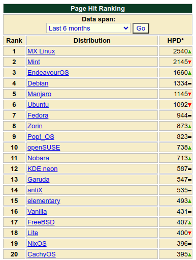
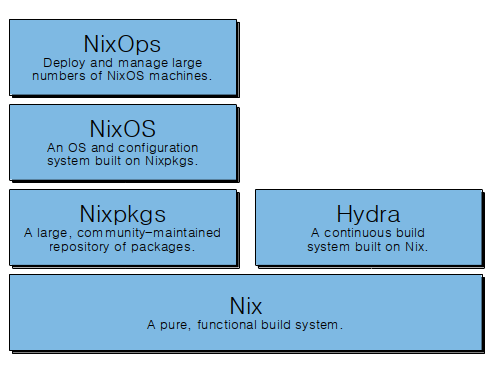
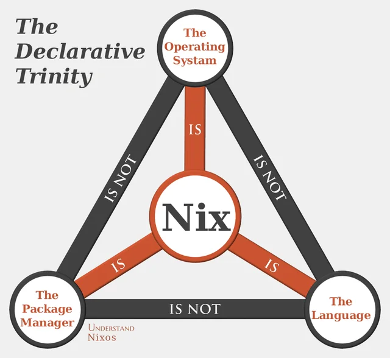
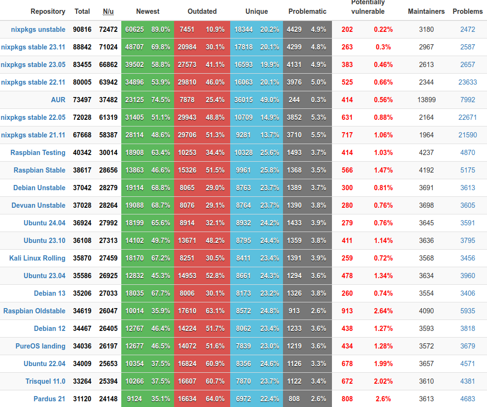
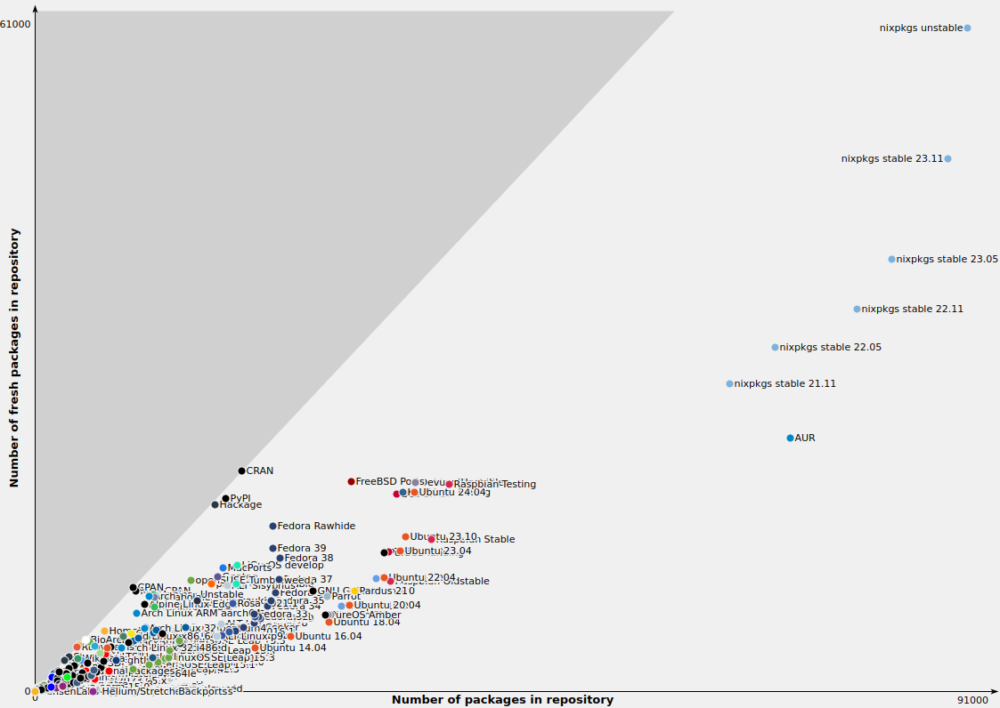

# NixOS: İşletim Sistemlerine Fonksiyonel Yaklaşım (Nix Öğreniyoruz 1)

Distrowatch sitesine bakacak olursak yüzlerce Linux dağıtımı olduğunu görebiliriz. Bunlardan biri de adını son zamanlarda daha sık duyduğumuz NixOS.

Özellikle sistem, test, otomasyon, cloud vb alanlarda çalışanların ilgisini çekeceğine eminim. Bu yazıyı Nixos'u ilk kez duyanlar için yazıyorum. Eğer devam etmek isterseniz diğer yazıları da takip edebilirsiniz.

1. [NixOS: İşletim Sistemlerine Fonksiyonel Yaklaşım](0.NixOs.md)
2. [Nix Dili ve Özellikleri](1.NixLanguage.md)
3. [Nix Dili ile ilgili Alıştırmalar](2.NixLanguage-Exercises.md)
4. [Nix Dilinde Builtins Fonksiyonlar](3.NixLanguage-Builtins.md) 
5. [Nix Paket Yöneticisi](4.Nix-Package-Manager.md)
6. [Nix Paket Yöneticisi Shell, Profile Kavram ve Komutları](5.Nix-Package-Manager-Shell-Profile.md)
7. [Nix Flake Nedir?](6.Nix-Package-Flake-CustomDerivation.md)
8. [Birden Çok Paketi Aynı Repo Üzeriden Yayınlamak](7.Nix-Package-Flake-CustomDerivation-Multiple.md) 
9. [Override ve Overlay Kavramları](8.Nix-Package-Overlay-Overrride.md)
10. [Nix Paket Yöneticisi ile Developer ve Profile Ortamları Oluşturmak](9.Nix-Package-Manager-Developer-Shell-Profile.md) 
11. [Nix ile NixOs Konfigürasyonu](10.Nix-With-NixOS.md) 
12. [NixOs Module ve Option Kullanımı](11.Nix-Nixos-Modules-Options.md)
13. [NixOs Kurulumu ve Konfigürasyonu](12.Nix-NixOs-Configuration.md)
14. [NixOs'u Cloud ve Uzak Ortamlara Deploy Etmek](13.Nix-With-NixOS-Iso-Docker-Cloud.md)

Nixos işletim sistemi eğer Nix dilini ve Nix Paket Yöneticisini anlayabilirsek mevzunun belki de en basit kısmı. Şimdi biraz ekosistemi anlamaya çalışalım.

Nix, Eelco Dolstra tarafından akademik bir proje olarak başladı. Dolstra'nın amacı, geleneksel paket yönetimi sistemlerinin karşılaştığı sorunları çözmek ve daha tutarlı bir sistem yönetimi sağlamaktı. Bu hedef doğrultusunda, fonksiyonel programlama prensiplerine dayanan bir dil olan Nix Expression Language (Nix) tasarlandı. Tez'e şu linkten ulaşabilirsiniz. [Nix: A Safe and Policy-Free System for Software Deployment](https://edolstra.github.io/pubs/phd-thesis.pdf)

- **2003-2006:** Nix'in erken dönemleri. Temel fonksiyonel prensiplerle paket yönetimi geliştirildi.
  
- **2006:** İlk kararlı sürüm olan Nix 0.8.1 yayımlandı. Bu sürüm, temel özellikleri içeriyordu ve kullanıcılarına deklaratif paket yönetimi sunuyordu.

- **2008-2012:** NixOS, Nix'in bir türevidir. NixOS, Nix'in paket yönetimi yeteneklerini temel alarak bir tüm işletim sistemini yönetmek için tasarlandı.

- **2018:** Nix, bir dizi geliştirme ve iyileştirmeyle Nix 2.0 sürümüne ulaştı. Bu sürüm, kullanıcı dostu araçlar, yeni özellikler ve performans iyileştirmeleri içeriyordu.

## Nix Dili, Paket Yöneticisi, NixOs ve NixOps Nedir?

Nix'in bu kadar karmaşık olmasının belki en önemli sebeplerinden biri gelişimi sırasında farklı ihtiyaçlara da cevap bulmasından dolayı bir çok araç ve teknik de geliştirmiş olmasıdır diyebiliriz. 

Başta sadece bir deployment dili olarak ortaya çıkmışken şimdi cloud ortamları için makine deployment aracı olarak bile kullanılabiliyor. NixOs'un popüler olmasıyla birlikte kullanmak isteyen herkes Nix dilinin karmaşasıyla yüzleşmek zorunda.  

Nix, temel olarak dört ana bileşenden oluşur: Nix Dili, Nix Paket Yöneticisi, NixOS ve NixOps. 

[Resim Kaynak](https://nixos.wiki/wiki/Nix_Ecosystem)

1. **Nix Dili:** Nix Dili, paketlerin ve sistem konfigürasyonlarının ifade edildiği fonksiyonel bir programlama dilidir. Nix dilindeki ifadeler, bir paketin veya sistem konfigürasyonunun nasıl oluşturulacağını belirler. 
2. **Nix Paket Yöneticisi:** Nix Paket Yöneticisi, sistemlere yazılım paketlerini yönetmek için kullanılan bir araçtır. Bu, Nix Dilini kullanarak ifade edilen paketleri indirip yükler. Kullanıcılar, Nix Paket Yöneticisi ile paketleri kurabilir, güncelleyebilir ve kaldırabilir. Yani Nix dili ile yazılmış paketlerimiz ve bir de paket yöneticimiz var. Eğer amacımız paket geliştirmek değilse en azından paketleri kurup çalıştıracak kadar  Nix CLI komutlarını bilmek gerekiyor. Linux kullanan hemen hemen hiç kimse hayatınca bir kez test amaçlı bile olsa paket yazmamıştır herhalde. Yani kaçımız her hangi bir Linux distrosu paket yöneticisi için geliştirme yapmışızdır ki? 

3. **NixOS:** Nix'in bir türevidir ve tamamen Nix Dili ile konfigüre edilebilen bir işletim sistemidir. Geleneksel dağıtımların aksine, NixOS'un tüm sistem konfigürasyonu bir dosya içinde deklare edilir. Kullanıcılar, NixOS kullanarak bir bilgisayarın veya sunucunun tüm konfigürasyonunu belirleyebilir. Bu, daha tutarlı ve tekrarlanabilir sistem yönetimi sağlar. Aslında Nix Dilinin temel amacı bütün Linux distroları için merkezi bir paket yöneticisi oluşturmak ve bu paket yöneticisini deklaratif bir şekilde yönetmekti. NixOs ise bu Dilin ve paket yöneticisinin yetenekleri üzerine ortaya çıkmış bir işletim sistemi. Yani NixOS'u kullanmak için Nix Dili ve Nix Paket Yöneticisini bilmek gerekiyor. Ancak tekrar söylemek istiyorum eğer paket yazmayacaksanız Nix Dilini çok iyi kullanmak zorunda değilsiniz. Sadece konfigürasyonu değiştirebilecek kadar bilmek yeterli.

4. **NixOps:** NixOps, Nix dilini ve Nix paketlerini kullanarak bulut altyapısında ve sanal makinelerde dağıtılmış sistemleri yöneten bir araçtır. Kullanıcılar, NixOps'u kullanarak belirli bir bulut sağlayıcısında veya sanal makineler üzerinde NixOS konfigürasyonlarını otomatik olarak dağıtabilir ve yönetebilir. Bu durumda eğer cloud ile işiniz yoksa veya özellikle bir NixOs sistemini dağıtmayı veya uzak sistemlere deploy etmeyi düşünmüyorsanız NixOps'u öğrenmenize gerek yok.

Tersten gidecek olursak NixOps için NixOs'u, NixOs için Nix Paket Yöneticisini, Nix Paket yöneticisi için de Nix Dilini bilmek gerekiyor.

Araştırma yaparken Çince bir sitede gördüğüm görsel çok hoşuma gitti. NixOps, NixOS ve Nix Paket Yöneticisi arasındaki ilişkiyi çok güzel özetliyor.

Bu grafik aslında Hristiyanlıktaki üçleme karmaşasını anlatabilmek için kullanılıyor. Burada da Nix karmaşasını anlatmak için güzel bir benzetme olmuş. 

[resim kaynak](https://blog.shuf.io/post/the-override-overrideAttrs-and-overlays-in-nixpkgs)

## Declarative, Imperative Kavramları

Nix Dili ve NixOs için deklaratif demiştik. Deklaratif olmayan versiyona da imperatif diyoruz. Peki arasındaki farklar nedir?

"Declarative" (deklaratif) ve "Imperative" (emir kipinde) terimleri, programlama dilleri, konfigürasyon yönetimi ve sistem tasarımı gibi birçok bağlamda kullanılan iki temel yaklaşımı tanımlar.

- **Deklaratif (Bildirimsel):**

   - Deklaratif yaklaşım, bir sistemi veya işlemi nasıl elde edileceği yerine ne elde edilmek istendiğiyle tanımlar. Yani, bir hedefin açıklamasıdır.

   - Kullanıcı, bir durumu belirtir ve sistem bu durumu sağlamak için gerekli adımları otomatik olarak gerçekleştirir. Kullanıcı, işlemin detaylarına odaklanmak yerine nihai durumu tanımlar.

   - SQL, HTML ve NixOS konfigürasyon dosyaları gibi deklaratif örnekler vardır. SQL'de bir veri setinin nasıl alınacağını değil, alınan veri setinin ne olması gerektiğini belirtirsiniz.

   - Daha kolay anlaşılır ve bakımı yapılabilir.
   - Yapılandırma dosyaları ve sistem konfigürasyonları genellikle daha kısa ve açık olabilir.

- **Emir Kipi (Imperative):**

   - Imperative yaklaşım, bir sistemi veya işlemi adım adım nasıl gerçekleştireceğimizi belirtir. Yani, bir işlemi adım adım açıklar ve her adımı belirli bir sırayla yürütür.

   - Kullanıcı, işlemin her adımını belirtir ve her adımın nasıl gerçekleştirileceğini ayrıntılı olarak açıklar.

   - Birçok programlama dilindeki genel programlama mantığı emir kipindedir. Örneğin, bir döngü içinde adım adım bir işlemin nasıl gerçekleştirileceğini belirlemeniz gerekir.

   - Daha fazla kontrol sağlar, özellikle belirli bir sıra veya koşul durumu gerektiren durumlarda.

   - **Deklaratif ve Imperatif Arasındaki Ana Fark:** Deklaratif, ne yapılması gerektiğini belirtirken, emir kipinde olan nasıl yapılması gerektiğini belirtir.

   - **Kullanım Bağlamı:** Deklaratif genellikle yapılandırma dosyaları, sorgu dilleri ve sistem konfigürasyonları gibi tanımlayıcı bağlamlarda kullanılırken, emir kipinde genellikle genel programlama ve adım adım kontrol gerektiren durumlarda kullanılır.

Yani özet olarak normal bir Linux distrosunda örneğin Ubuntu'da bir uygulamayı kurmak için `sudo apt install uygulama_adi` komutunu veririz. Bu bir komuttur yani bir dilden bahsetmiyoruz veya bir konfigürasyondan da bahsetmiyoruz. Ancak NixOs üzerinde konfigürasyon dosyasına uygulamanın adını  yazmamız yeterli. Yani bir komut yazmıyoruz sadece adını yazıyoruz. Tek bir uygulama için bu dediğim etkileyici olmayabilir ancak onlarca uygulama adını yazıp tek seferde hapsini kurabiliyor olmak çok etkileyici. Ayrıca bu konfigürasyon dosyasını başka bir sistemde de kullanırsak aynı sistemi tekrar ayağa kaldırabiliriz. Bu haliyle ciddi şekilde deklaratif bir yapıya sahip. Yani elimizdeki tek bir dosya ile yüzlerce sistemi ayağa kaldırabiliriz. 

## Yetenekleri Nelerdir?

Şimdi bütün bu araçların neler yapabileceğine bakalım.

- Diyelimki bir terminal açtınız ve o terminal içinde bir uygulamayı kullanıp sistemde hiç bir iz bırakmadan kaldırmak istiyorsunuz. Terminalinizi kapattığınızda sistem otomatik olarak herşeyi temizlesin istiyorsunuz. Bunu Nix paket yöneticisi ile yapabilirsiniz.
- Birden fazla proje klasörünüz var ve her birinde farklı programlama dilleri ile geliştirme yapıyorsunuz veya program kullanıyorsunuz diyelim. İlla programlama yapmak zorunda değilsiniz herhangi bir program olabilir. İlgili klasörde çalışacağınız zaman sisteminizde gerekli programlar kurulsun ve siz işinizi bitirdiğinizde sistemden kaldırılsın istiyorsunuz. Bunu Nix paket yöneticisi ile yapabilirsiniz.
- Tamamen sıfırdan bir docker image oluşturabilirsiniz.
- İçinde istediğiniz programların olduğu kuruluma hazır bir ISO oluşturabilirsiniz.
- Elinizdeki konfigürasyon dosyasını kullanarak cloud ortamında veya uzak bir makinede NixOs'u kurabilirsiniz.
- Kendi kişisel masaüstü ortamınızı deklaratif bir şekilde oluşturabilirsiniz. Yani örneğin KDE/Plasma kullanacaksınız ve bir çok custom değişiklik yaptınız tekrar kurulum yaptığınız bütün ayarlarınızı Nix ile bir dosyaya kaydedebilirsiniz.
- Bütün bir işletim sistemi kurulumunu ve ayarlarınızı 3-5 adet dosyaya sığdırabilirsiniz ve bunu bir git reposunda saklayabilirsiniz.
- Bir uygulamanı farklı versiyonlarını aynı anda kurabilir ve istediğiniz versiyonu çalıştırabilirsiniz.
- Tek bir konfigürasyonu kullanarak [nix-generator](https://github.com/nix-community/nixos-generators) aracı ile  alttaki bütün ortamlara çıktı üretebilirsiniz.

format | description
--- | ---
amazon | Amazon EC2 image
azure | Microsoft azure image (Generation 1 / VHD)
cloudstack | qcow2 image for cloudstack
do | Digital Ocean image
docker | Docker image (uses systemd to run, probably only works in podman)
gce | Google Compute image
hyperv | Hyper-V Image (Generation 2 / VHDX)
install-iso | Installer ISO
install-iso-hyperv | Installer ISO with enabled hyper-v support
iso | ISO
kexec | kexec tarball (extract to / and run /kexec_nixos)
kexec-bundle | same as before, but it's just an executable
kubevirt | KubeVirt image
linode | Linode image
lxc | create a tarball which is importable as an lxc container, use together with lxc-metadata
lxc-metadata | the necessary metadata for the lxc image to start, usage: `lxc image import $(nixos-generate -f lxc-metadata) $(nixos-generate -f lxc)`
openstack | qcow2 image for openstack
proxmox | [VMA](https://pve.proxmox.com/wiki/VMA) file for proxmox
proxmox-lxc | LXC template for proxmox
qcow | qcow2 image
raw | raw image with bios/mbr. for physical hardware, see the 'raw and raw-efi' section
raw-efi | raw image with efi support. for physical hardware, see the 'raw and raw-efi' section
sd-aarch64 | Like sd-aarch64-installer, but does not use default installer image config.
sd-aarch64-installer | create an installer sd card for aarch64. For cross compiling use `--system aarch64-linux` and read the cross-compile section.
vagrant-virtualbox | VirtualBox image for [Vagrant](https://www.vagrantup.com/)
virtualbox | virtualbox VM
vm | only used as a qemu-kvm runner
vm-bootloader | same as vm, but uses a real bootloader instead of netbooting
vm-nogui | same as vm, but without a GUI
vmware | VMWare image (VMDK)

[Tablo Kaynak](https://github.com/nix-community/nixos-generators)

**Nix paket yöneticisi ile ilgili söylediğim her şey NixOs olmaksızın tün Linux dağıtımlarında, MacOs'da ve Windows WSL' de çalışıyor.**

## Infrastructure as Code (IaC) Sistemlerinden ve HashiCorp Packer'dan Farkı Nedir?  

Şimdi aklımıza şu gelebilir, zaten bir çok araç var neden Nix'i öğrenelim? IoC  araçlarının temel amacı aslında doğrudan tek bir makine değil belki binlerce sunucuyu yönetmek. Hatta belki şu bile denilebilir gerekli plugin'lerle birlikte ekosistemi (farklı işletim sistemleri, network cihazları vb) yönetmek. Nix'in temel amacı deklaratif olarak bir makinenin bir doküman üzerinden her zaman aynı sonucu vermesini sağlamak. Bu bağlamda aslında Infrustracture as Code sistemleri NixOS'un üzerinde bir yapıdır. Örneğin Chef veya Puppet ile bi NixOs'u yönetebilirsiniz. Binlerce NixOs sunucunu ayağa kaldırıp yönetebilirsiniz. Bunu yaparken de Nixos konfigürasyon dosyasını kullanabilirsiniz. Ayrıca tabii ki bu araçların bir paket yöneticisi yok. Dolayısıyla işletim sistemei seviyesindeki bir işi daha üst seviyede iş yapan bir araca yaptırmış oluyoruz. 

HashiCorp Packer'ın temel amacı farklı ortamlar için isşetim sistemi image'ları oluşturmak. Bunu yaparken deklaratif bir yol izlemiyoruz daha çok prosedürel olarak bir birini takip eden adımlarla bir image oluşturuyoruz. Nix en temelinde bir cross-platform bir paket yöneticisi olmaya çalışıyor. Aslında NixOs, NixOps ve nix-generetor gibi araçlar paket yönetcisive Nix dilinini yetenekleri üzere sonradan geliştirilmiş araçlar. Bu araçlardan örneğin nix-generator ve NixOps kullanarak Packer'ın yaptığını yapabilir hale geliyoruz. Ancak bunu sadece NixOs işletim sistemi için yapabiliyoruz. Amaç Packer'ın yerini almak değil zaten. Hatta packer NixOs'u da kullanabilir. Ayrıca Packer'ın bir paket yönetici olmadığını tekrar hatırlatıyorum

Packer, önceden yapılandırılmış bir yapıyı alır ve bu yapı üzerinde bir dizi adımı (örneğin, kurulum, yapılandırma, paket yükleme) gerçekleştirerek sonuç olarak bir sanal makine görüntüsü veya konteyner görüntüsü oluşturur. NixOS ise tamamen beyaz kutu bir yaklaşım benimser. Kullanıcılar, Nix ifadeleriyle işletim sisteminin her yönünü açıkça belirtirler. Bu, her şeyin tam olarak nasıl yapılandırılacağını kontrol etmelerine olanak tanır. Bu sayede Nix dokümanlarınız Packer dokümanlarınızdan farklı olarak canlıdır. Yani sistem çalışırken bile konfigürasyonu değiştirebilir ve tekrar çalıştırabilirsiniz.  

## Neden NixOs Kullanmamalıyız?

Sadece paket yöneticisindeki paketleri kurar çalıştırırım geriyle ilgilenmiyorum diyen bir son kullanıcıysanız bir satır komutla tüm sisteminizi kurabilirsiniz. Büyük ihtimal bir uygulama Nixos paket yöneticisinde yoksa başka bir yerde yoktur. 

Linux dağıtımlarının istatistiklerinin yayınlandığı [Repology](https://repology.org/repositories/statistics/total) sayfasındaki rakamlara göre Nix paket reposunda en yakın Arch Linux'un AUR paket yöneticisinden farklı 17 bin adet daha fazla paket var. Buna tabi Nix'in resmi paket yöneticisinde olmayan Github, Gitlab, hatta bir FTP adresi veya bir URL üzerinden de yükleyebileceğiniz Nix paketleri hariç. Nix paket yöneticisi ile yazılmış bir paketi doğrudan herhangi bir adresten yükeyebilirsiniz. Paket yönetcisi bunu cache sunucularında bulamazsa local sistemde build alabilir.

Ayrıca sisteme bir şey kurdum patladı gibi bir durumda rollback yapmak mümkün.  Dolayısıyla bu tarz bir son kullanıcıysanız sadece bir uygulamanın adını yazmanız yeterli kurulum için. Hatta onlarca yeni uygulamanın adını listeye ekleyip, bazıların listeden silip veya bazıları üzerinde değişiklik yapıp  tek seferde bütün değişikliği sisteminize uygulayabilirsiniz.

Yani kişisel hayatınızda uzman olsanız da olmasanız da zevkle kullanabileceğiniz bir işletim sistemi. Eğer iş bilgisayarınızda kullanacaksanız ufak tefek problem çözebilecek kadar Nixos'a hakim olmanız gerekebilir. 

Ancak eğer amacınız hakikaten sistemin uzmanı olmak ve profesyonel olarak iş hayatınızda da kullanmaksa altta sıralayacağım maddeleri dikkate almanızda fayda var.

- Çok büyük faydaları olmasına rağmen konfor alanınızdan uzaklaşıp yorucu bir öğrenme sürecine girmeniz gerekiyor. Mevzuya hakim olmak için en azından  fonksiyonel bir dil olan Nix'i  öğrenmeniz gerekiyor.
- Öğrenme süresince yüzlerce kez deneme yanılma yapmak zorunda kalacaksınız. Bakış açımızı değiştirmemiz gerekiyor ancak dokümanlar yetersiz ayrıca topluluk da herkese yetişemiyor. Topluluğun verdiği örnekler ya çok basit veya tarihi geçmiş çok karmaşık örnekler.
- Birçok durumu ilk kez yaşıyor olacaksınız ve bunlar Google için de yeni olacak.
- Declarative, immutable gibi kavramlar sizin için hiç bir şey ifade etmiyorsa büyük yanlış bir yolda olabilirsiniz.
- Kişisel olarak kullanmayacaksanız, tamamen iş ortamınızda Nixos'un avantajlarından faydalanmak için öğrenecekseniz ve ortamınızda 3-5 makine varsa attığınız taş ürküttüğünüz kurbağaya değmeyebilir.
- Nix paket yöneticisini ve Nixos'u incelediğinizde ihtiyacınız olup olmadığını kendiniz anlayamıyorsanız veya karar vremiyorsanız Nixos'a bulaşmanıza gerek olmayabilir.

Ancak hiç kullanmayacaksanız bile kendi kullandığınız dağıtıma Nix paket yöneticisini kurmanızı kesinlikle tavsiye ederim. Özellikle geliştirici olarak çalışıyorsanız internette Nix paket yöneticisi üzerine kurulu bir çok araç var. Hatta illa geliştirici olmanıza gerek yok aynı anda bir uygulamanın birden faza versiyonunu kullanıyorsanız da tercih edebilirsiniz. İlerleyen yazılarda bu konuya değiniyoruz ama yine de altta en çok kullanılanları ekledim. 

Örneğin Python, NodeJS, Java, Dotnet vb programlama dillerinin biri veya bir kaçında faklı versiyonlarda uygulama geliştiriyorsunuz diyelim. Bu durumda örneğin NodeJS için nvm, Python için virtualenv benzeri araçlar kullanabilirsiniz. Ancak programlama dilleri dışındaki uygulamaların böyle bir yeteneği yok. Ayrıca her biri için ayrı ayrı uygulama yönetmektense declarative olarak yönetebileceğiniz tek bir araç daha mantıklı görünüyor. Diğer bir sebepte Nix paket yöneticisi bilgisayarınız kirletmeden sandbox olarak bunu yönetiyor.

- [devbox](https://github.com/jetpack-io/devbox): Aralarında en çok kullanılan ve en çok yıldız alan proje bu. İncelemenizi kesinlikle tavsiye ederim. Dockerhub benzeri [nixhub](https://www.nixhub.io) adında  bir paket deposu var. Burada arama yapabiliyorsunuz. Go dili ile yazılmış  bir cli'ı var. Quickstart için [şu sayfayı](https://www.jetpack.io/devbox/docs/quickstart/) ziyaret edebilirsiniz.

- [devshell](https://numtide.github.io/devshell/) 

- [devpacks](https://nixpacks.com/docs)

- [devenv](https://devenv.sh/)

Kısa bir giriş yaptık. Amacım Nix Paket yöneticisine ve NiXOS'a ilgi uyandırmaktı. Eğer ilginizi çektiyse makale serisine devam edebilirsiniz.

Umarım faydalı olmuştur.

# Kaynaklar
- https://nix-community.github.io/awesome-nix/
- https://en.wikipedia.org/wiki/NixOS
- https://edolstra.github.io/pubs/phd-thesis.pdf
- https://nixos.wiki/wiki/Nix_Ecosystem
- https://github.com/hlissner/dotfiles#frequently-asked-questions

