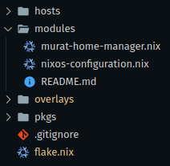
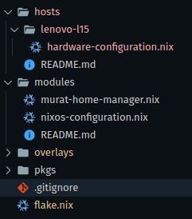
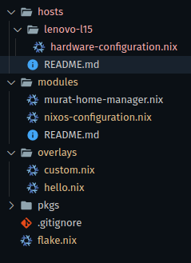
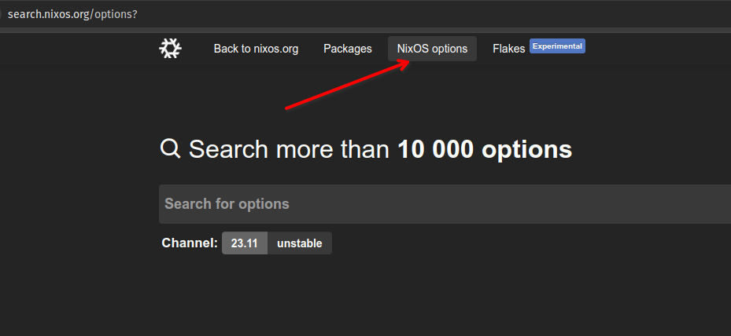
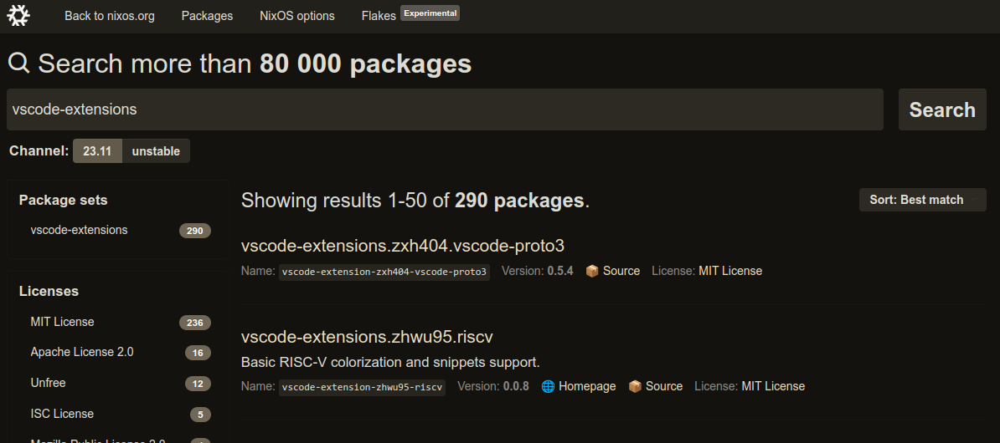
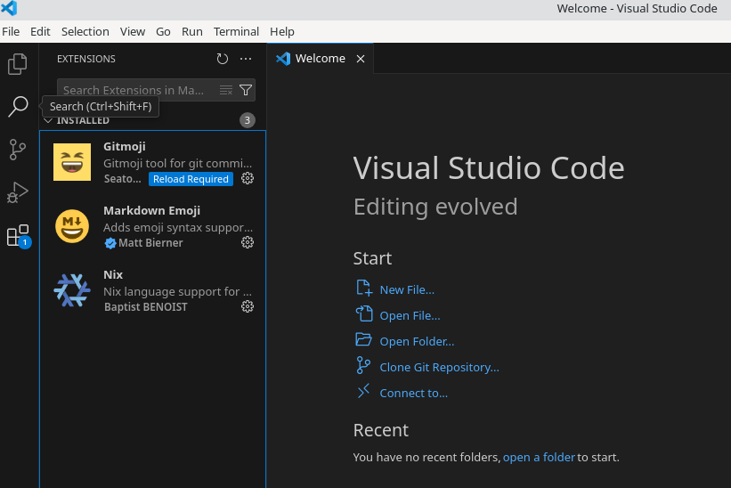
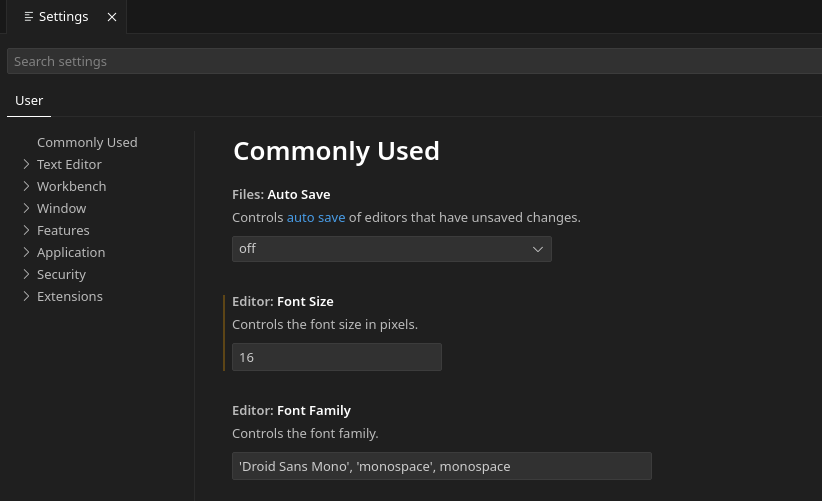
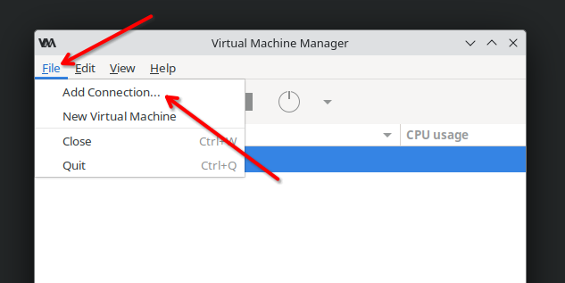
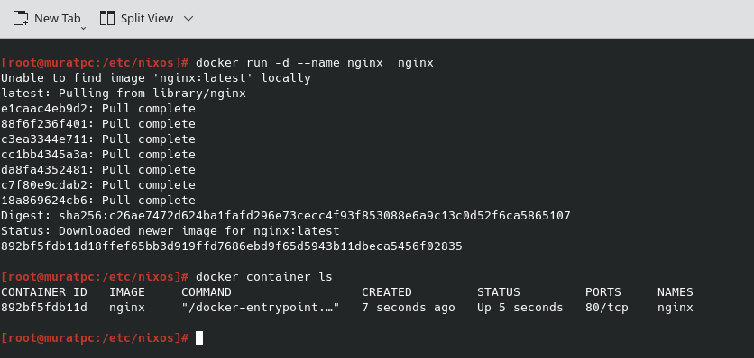
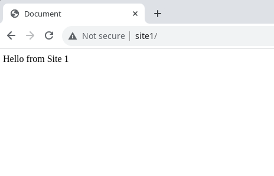

## NixOs Kurulumu ve Konfigürasyonu (Nix Öğreniyoruz 12)

Bu yazımızda daha önce kurmuş olduğumuz NixOs konfigürasyonunu yapmaya devam edeceğiz. 

Yazının en sonunda örnek olarak incelenebilecek bir çok repo'nun da linklerini verdim. Onlarda da faydalanarak örneğimizi yavaş yavaş geliştireceğiz.

1. [NixOS: İşletim Sistemlerine Fonksiyonel Yaklaşım](0.NixOs.md)
2. [Nix Dili ve Özellikleri](1.NixLanguage.md)
3. [Nix Dili ile ilgili Alıştırmalar](2.NixLanguage-Exercises.md)
4. [Nix Dilinde Builtins Fonksiyonlar](3.NixLanguage-Builtins.md) 
5. [Nix Paket Yöneticisi](4.Nix-Package-Manager.md)
6. [Nix Paket Yöneticisi Shell, Profile Kavram ve Komutları](5.Nix-Package-Manager-Shell-Profile.md)
7. [Nix Flake Nedir?](6.Nix-Package-Flake-CustomDerivation.md)
8. [Birden Çok Paketi Aynı Repo Üzeriden Yayınlamak](7.Nix-Package-Flake-CustomDerivation-Multiple.md) 
9. [Override ve Overlay Kavramları](8.Nix-Package-Overlay-Overrride.md)
10. [Nix Paket Yöneticisi ile Developer ve Profile Ortamları Oluşturmak](9.Nix-Package-Manager-Developer-Shell-Profile.md) 
11. [Nix ile NixOs Konfigürasyonu](10.Nix-With-NixOS.md) 
12. [NixOs Module ve Option Kullanımı](11.Nix-Nixos-Modules-Options.md)
13. [NixOs Kurulumu ve Konfigürasyonu](12.Nix-NixOs-Configuration.md)
14. [NixOs'u Cloud ve Uzak Ortamlara Deploy Etmek](13.Nix-With-NixOS-Iso-Docker-Cloud.md)

Alttaki çalışmanın son halini de [Github'daki repo](https://github.com/muratcabuk/nixos-sample-dotfiles) üzerinden inceleyebilirsiniz. Adım adım her değişimi ayrı bir branch olarak ekleyeceğim. Kod değişeceği için geri dönük takip edebilirsiniz kodu.

## Klasörlerin Kullanım Amaçları
Bir bilgisayarda ne tür ayarlar yaparız bi listeleyelim.


- **Makinemizin kullanıcıdan bağımsız donanımsal ayarları**: Disk yapısı, driver'lar, bluetooth, sensör, dış cihazlar (yazıcı, monitor, kamera vb) ayarlar. Tabi eğer birden fazla makine yönetiliyorsa o zaman makine sayısı kadar ayar gerekiyor. 
- **İşletim sisteminin kullanıcıdan bağımsız ayarları**: Hangi modüller kullanılacak, hangi servisler çalışıyor olacak, sistem üzerinde tüm kullanıcılar için ortak olacak diğer ayarlar.
- **Sistem üzerinden kullanıcıdan bağımsız kurulması gereken uygulamalar**: Hangi kullanıcı sistemi kullanırsa kullansın olması gereken uygulamalar. Mesela bir servis, office uygulaması veya basit bir çizim programı gibi. Tabi bunların kullanılabilmesi içinde bir masaüstü ortamı (kde, gnome) gerekiyor. 
- **Kullanıcının kişisel ayarları**: Kişinin kullanacağı uygulamalar me masaüstü ortamı ayarları
- **Kullanıcının kişisel uygulamaları**: Kişinin sadece kendisinin kullandığı, diğer kullanıcılara paylaştırılmayacak uygulamalar.  Tabi her kullanıcı kendisi isterse kurabilir aynı uygulamayı.


Bütün bu sistemi kurmak için herkesin farklı bir dosya yönetme stratejisi var. Alttaki örnek linklerden farklı kullanıcıların repo'larını inceleyebilirsiniz. Bazı klasör adlarını hemen hemen hepsinde görebilirsiniz.


- **Hosts/machines** : Kullanılacak Bilgisayarın ayaları için kullanılır. BAzıları donanımsal işleri machines klasörüne, diğer ayarları da hosts klasörüne koyabiliyor.
- **Home/Users** : Kullanıcıya özel ayarlar ve uygulamalar için kullanılır.
- **Pkgs/Packages**: Bizzat ilgili konfigürasyon içinde build alınıp derivation/package oluşturulacak paket bilgileri bulunur.
- **Overlays**: Nixpkgs üzerindeki değişiklikler, pkgs/packages klasöründeki paketlerin yüklenmesi ve diğer paket repo'larından yüklenen paketlerin override işlemleri  gibi işler için kullanılır.
- **Modules** : Nixos konfigürasyonu için kullanılır. Burada önemli olan konu her kim olursa olsun yani kişiye bağlı olmadan yapılan konfigürasyonlar burada olmalı.
- **Lib** : Custom yazılan fonksiyonlar konulur.
- **Scripts/Config/Bin** : Bazen Nixos module ve option'ları yetersiz gelebilir. Bu gibi durumlarda script yazmak gerekebilir. Hem bu script'leri hem de kullanılan konfigürasyon dosyalarını burada tutulur.


NixOs klasör yapısı için bize bir best practice sunmuyor. Yani tamamen nasıl bir şey yapacağımız tamamen bize kalmış

Bu yazıda elimden geldiğince sade kalmaya çalışacağım. Hem yazıyı bitiremeyiz hem de amacımız zaten mükemmel bir sistem kurmak değil daha çok mantığını anlamak. Devamını getirmek artık sizin elinizde. Bu arada ben de kendi sistemlerimde mümkün olduğunca sade tutmaya çalışıyorum. Gereksiz yere kullanmayacağımız  konfigürasyonları yönetmeye gerek yok.

Tek bir makine ve tek bir kullanıcı için system konfigürasyonu yapacağız. Dosya yapımız alttaki gibi olacak



- **Host**: Makine hardware ayarlarımızın olduğu klasör
- **Modules**: NixOs konfigürasyonunun ve kullanıcı home dizini ve diğer kişisel ayarlarının olduğu klasör
- **Overlays**: Custom geliştirilen uygulamaların ve diğer paket yöneticilerinden yüklenen uygulamaların yüklenme öncesinde yapılacak değişikliklerinin yönetildiği overlay dosyalarının konulduğu klasör
- **Pkgs**: Custom geliştirilen uygulamaların bulunduğu klasör

Bu arada bütün klasörlerde README dosyası mevcut, bu dosyalardan bulunduğu klasör ve uygulama hakkında bilgi alabilirsiniz.


## Dosya ve Klasör Yapısının Oluşturulması

Adım adım sistemimizi kurmaya başlayalım.

1. Öncelikle hosts klasörünüze makinemizin adını/modelini içeren bir klasör oluşturalım ve root dizinde olan `hardware-configuration.nix` dosyasını bu klasöre kopyalayalım. 



İlerde belki farklı sistemler de eklemek sitesebiz yapınız hazır olmuş olur.


2. Root dizindeki `nixos-configuration.nix` dosyasını da modules klasörüne taşıyalım ve bu dosyada en üstte yer `hardware-configuration.nix` dosyasının adresini değiştirelim. Ayrıca ` networking.hostName = "muratpc";` satırında önceden hostname Nixos olarak yazıyordu onu da sistem adıyla aynı yaptım yani muratpc. Siz de istediğiniz gibi değiştirebilirsiniz. İlla sistem adıyla hostname aynı olmak zorunda değil farklı isimler de verilebilir.

```nix
{ config, pkgs, ... }:

{
  imports =
    [ # Include the results of the hardware scan.
      ../hosts/lenovo-l15/hardware-configuration.nix
    ];

# KISALTILDI

```
3. modules klasörünüze `home-manager.nix` dosyanızı ekleyin. Ben prefix olarak kendi adımı kullandım .Hangi user için olduğu belli olsun. İlerde belki farklı kulalnıcılar da ekleyebilirsiniz. İçini boş bırakın şimdilik ilerde dolduracağız.
4. Pkgs klasörünü oluşturalım. Bu klasörde kendi yazdığımız paketler olarak. Eğer yazı dizisini baştan beri okuduysanız zaten içinde daha önceki yazılarda oluşturduğum örnek paketleri koydum. Bu paketleri sizde Github sayfamdaki repo'dan alabilirsiniz. Uygulamalar farklı şekillerde nasıl kendi paketlerinize yazabilirsiniz bunlar için de örnek olmuş oluyor. Zaten her bir uygulama klasöründe README dosyası var onlardan da bilgi alabilirsiniz. 
5. Overlays klasörünü oluşturalım. Bu klasörde de hem kendi yazdığımız paketlerde hem de diğer paket repo'larından yüklediğimiz paketlerde yüklenme öncesi değişiklikleri yönetiyoruz. Hatırlarsanız önceki yazılarımızda paket yüklemenin bile bir nixpkgs üzerinde bir değişiklik yapmak anlamına geldiğinden bahsetmiştik. Bu nedenle kendi yazdığımız paketlerin sisteme yüklenmesini ve yüklenme öncesi yapılacak değişiklikleri de buradan yönetiyoruz.

Burada da şimdilik 2 dosya `custom.nix` ve `hello.nix` buluyor.  



`custom.nix` dosyasında kendi yazdığımız paketlere ait overlay işlemleri varken `hello.nix` içinde NisOs repo'sudan yer alan hello uygulamasına yönelik overlay ayarları bulunuyor.

`Custom.nix` dosya içeriği

```nix
# custom.nix
final: prev: {
  defaultapp = import ../pkgs/default {pkgs = final;};
  defaultfile = import ../pkgs/defaultfile {pkgs = final;};
  defaultalt = import ../pkgs/defaultalt {pkgs = final;};
  nixapp = import ../pkgs/nixapp {pkgs = final;};

  # uygulama build alınırken v3.0 kullanılsın
  message = import ../pkgs/message {
    pkgs = final;
    version = "v3.0";
  };

  # uygulama build alınırken v3.0 kullanılsın
  testapp = import ../pkgs/testapp {
    pkgs = final;
    version = "v3.0";
  };
}

```

`Hello.nix` dosya içeriği

```nix
# hello.nix

final: prev: {

  # uygulama build alınırken 2.9 kullanılsın
  hello-custom = final.hello.overrideAttrs (old: rec {
    name = "hello-custom";
    version = "2.9";
    src = final.fetchurl {
      url = "mirror://gnu/hello/hello-${version}.tar.gz";
      sha256 = "sha256-7Lt6IhQZbFf/k0CqcUWOFVmr049tjRaWZoRpNd8ZHqc=";
    };
  });

  hello-new = final.hello;

}

```

6. `Flake.nix` dosyasını alttaki gibi değiştiriyoruz. Değişiklikler açıklama satırı olarak eklendi.


```nix
{
  description = "Murat Cabuk NixOs Configuration";

  inputs = {
    nixpkgs.url = "github:NixOS/nixpkgs/nixos-23.11";
  };

  outputs = { self, nixpkgs, ... }@inputs: 
  let

    # üzerinde çalıştığımız sistemin Nix'deki kod addı.
    system = "x86_64-linux";

    # 2 adet overlay var
    overlays = [
                (import ./overlays/custom.nix) 
                (import ./overlays/hello.nix)
               ] ;
    # ne tür bir sistemde çalışıyorsak onun için nixpkgs koleksiyonu ve kütüphanesi oluşturuluyor.
    pkgs = import nixpkgs {
              inherit system;
              overlays = overlays;
            };

    # build alınan veya override edilen paketler bu flake ile yayınlanıyor.
    packages = {
        x86_64-linux.default = pkgs.defaultapp; 
        x86_64-linux.defaultfile = pkgs.defaultfile; 
        x86_64-linux.defaultalt = pkgs.defaultalt; 
        x86_64-linux.nixapp = pkgs.nixapp;
        x86_64-linux.message = pkgs.message; 
        x86_64-linux.testapp = pkgs.testapp;
        x86_64-linux.hello = pkgs.hello;
        x86_64-linux.hello-custom = pkgs.hello-custom;
    };

  in {

    # bu sistemin adı muratpc olarak değiştirildi
    nixosConfigurations.muratpc = nixpkgs.lib.nixosSystem {
      
      # systm bilgisi yukarıda tanımlana system değişkeniniden alındı
      system = system;

      # dosya adresi değiştirildi
      modules = [
        ./modules/nixos-configuration.nix
      ];
    };
   
    packages = packages;
  };
}
```
Şimdi `flake.nix` dosyamız neler sunuyor ona bir bakalım.

```bash
nix flake show . --impure --all-systems
warning: Git tree '/home/.../nixos-sample-dotfiles' is dirty
warning: creating lock file '/home/muratcabuk/projects/GitHub/nixos-sample-dotfiles/flake.lock'
warning: Git tree '/home/.../nixos-sample-dotfiles' is dirty
git+file:///home/.../nixos-sample-dotfiles
├───nixosConfigurations
│   └───nixos: NixOS configuration
└───packages
    └───x86_64-linux
        ├───default: package 'default'
        ├───defaultalt: package 'defaultalt'
        ├───defaultfile: package 'defaultfile'
        ├───hello: package 'hello-2.12.1'
        ├───hello-custom: package 'hello-custom'
        ├───message: package 'message'
        ├───nixapp: package 'nixapp'
        └───testapp: package 'testapp'
```

Ever görüleceği üzere flake dosyamız bir NixOs sistem birde 8 adet paket sunuyor.

Şimdide yaptığımız değişiklikleri sisteme uygulayalım. Bunun için alttaki komutu çalıştırıyoruz. Eğer siz de `flake.nix`  dosyasında system adını nixos dışında başka bir isme çevirdiyseniz altta muratpc yerine o ismi yazmalısınız. Eğer değiştirmediyseniz de nixos yazmalı.

```bash
sudo nixos-rebuild switch --flake .#muratpc
# sistem adı aynı kaldıysa
# sudo nixos-rebuild switch --flake .#nixos
```

Bu komut sonrasında aslında bizim doğrudan hissedebileceğimiz bir şey olmadı. Sadece hostname değişti onu da `cat /etc/hostname` komutu ile görebiliriz.

Hissetmediğimiz tarafta ise custom geliştirmiş olduğumuz uygulamalar build alındı ve build alınabilmeleri için gerekli olan paketler de kuruldu. Ancak bu uygulamalar doğrudan PATH'a ekli değil çünkü biz kurulumlarını ve user bazında erişilebilmesi için gerekli ayarları yapmadık. Ancak bir developer olarak bu test edemeyeceğimiz anlamına gelmiyor. Alttaki komutlarla test edebiliriz.

```bash

nix run .#default  --impure

nix run .#message --impure

nix run .#hello --impure

```

Ancak mesela hello uygulamasına terminalden erişmeyi denediğimizde sonuç alamayacağız. 

Bu kısmı bu şekilde hızlı geçiyorum daha fazla detaya girmeden çünkü çok büyük ihtimal bu yazıyı okuyanların büyük bir kısmı bu tarz bir işlem yapamayacaktır yani kendi kod yazıp yada internetten bir projeyi, bulup build alama yoluna gitmeyecektir. Zaten bunu düşünenleriniz varsa geriye dönük bütün yazılar bu konuyu anlatıyor. Yani NixOs'u ayarlamak ona paket yazmaktan daha kolay. 


Github sayfamda geldiğimiz noktaya kadar olan kodları [file-structure](https://github.com/muratcabuk/nixos-sample-dotfiles/tree/file-structure) adlı branch'de bulabilirsiniz.


## Nix-Configuration Dosyasının İncelenmesi

Dosyayı açıklama satırlarını silerek sadeleştirdim ve her bir ayar için açıklamalar ekledim. Bundan dolayı sizinkinden biraz farklı görünüyor olabilir.


```nix
{ config, pkgs, ... }:

{
  imports =
    [ # Burada donanımsal ayarlarımızın olduğu diğer bir module import ediliyor
      ../hosts/lenovo-l15/hardware-configuration.nix
    ];

 # Nix flake halen geliştiriliyor tam release olmadı. 
 # Buna rağmen çok stable ve neredeyse NixOs ile ilgili herkes flake'i artık aktif olarak kullanıyor 
 # Ancak halen release olmadığı için deneyimsel bir özellik olarak kabul ediliyor.
 # bundan dolayı bunu kullanmak için enable etmemiz gerekiyor
 nix.settings.experimental-features = [ "nix-command" "flakes" ];

  # Bootloader.
  boot.loader.grub.enable = true;
  boot.loader.grub.device = "/dev/sda";
  boot.loader.grub.useOSProber = true;

  # hem bilgisayar adımız hem de bir network'de bilgisayara erişmek için kullanılan isim
  networking.hostName = "muratpc"; 

  # Network ayarlarının yapılabilmesi için gerekli.
  # Sadece Network MAnager yok aslında Linux dünyası için ancak ben de en iyilerinden biri
  networking.networkmanager.enable = true;

  # TimeZoe ayarı
  time.timeZone = "Europe/Istanbul";

  # Windows'daki bölgesel ayarlarla aynı işi yapıyor. 
  # Yani  mesela para birimi, ölçüm ayalarları, Klavye karakterleri vb Türkiye'ye özel ayarların baz alınacağını söylüyor. .
  i18n.defaultLocale = "tr_TR.UTF-8";
  i18n.extraLocaleSettings = {
    LC_ADDRESS = "tr_TR.UTF-8";
    LC_IDENTIFICATION = "tr_TR.UTF-8";
    LC_MEASUREMENT = "tr_TR.UTF-8";
    LC_MONETARY = "tr_TR.UTF-8";
    LC_NAME = "tr_TR.UTF-8";
    LC_NUMERIC = "tr_TR.UTF-8";
    LC_PAPER = "tr_TR.UTF-8";
    LC_TELEPHONE = "tr_TR.UTF-8";
    LC_TIME = "tr_TR.UTF-8";
  };


  # xserver için keyboard ayarları
  services.xserver = {
    layout = "tr";
    xkbVariant = "";
  };

  # console için keyboard ayarları
  console.keyMap = "trq";

  # Normal bir kullanıcı tanımlıyoruz ve onu wheel ve network manager gruplarına ekliyoruz.
  # wheel grubu birçok linux dağıtımındaki sudo grubuyla aynı şeyi ifade eder.
  users.users.muratcabuk = {
    isNormalUser = true;
    description = "murat cabuk";
    extraGroups = [ "networkmanager" "wheel" ];
    packages = with pkgs; [];
  };

  # free paketlerin kullanılmasına izin verdik
  nixpkgs.config.allowUnfree = true;

  # ileride buna değişenceğiz. 
  #Bİr masaüstü ortamı kurduğumuzda SSh yerine VirtualBox üzeriden GUI kullanmak ve 
  # Host ile dosya alışverişi sağlam için kullanıan ayalarlar.
  virtualisation.virtualbox.guest.enable = true;
  virtualisation.virtualbox.guest.x11 = true;


  # Sistemde kullanıcıdan bağımsız kullanılacak paketler
  # ilerde buraları da değiştireceğiz. 
  environment.systemPackages = with pkgs; [
    vim 
    wget
    curl
    git
  ];

   # SSh ı açtık
   services.openssh.enable = true;

  # Firewall'ı kapattık
   networking.firewall.enable = false;

   # Sistemde kullanıcıdan bağımsız kullanılacak paketler
   system.stateVersion = "23.11";
}

```

Tabi bir çok ayar yapacağımız için gerçek bir konfigürasyonda bu aynı hardware configuration modülünde olduğu gibi konfigürasyonları farklı modüllere bölmek gerekebilir.


Diğer önemli konu da dosyada en attaki stateVersion numarası ne işe yarar? Bunu da alttaki başlıkta inceleyelim.

## NixOs Nasıl Upgrade Edilir?

Bu versiyon numarasını tabiri caizse dokümanımızın versiyon numarası olarak düşünebiliriz. 


- Öncelikle kesinlikle stateVersion numarasını bir sonraki sürün notunu okumadan asla değiştirmiyoruz. Bu sistemin bozulmasına neden olabilir. Daha da kötüsü rollback de çalışmayabilir.
- Sistem bulunduğumuz stateVersion üzerinden paket güncellemelerini otomatik olarak yapar.
- Bu değerin mevcut NixOS sürümünden daha düşük olması, sisteminizin modası geçmiş, destek dışı veya savunmasız olduğu anlamına gelmez.
- Bundan dolayı bu değeri, yapılandırmamıza yapacağı tüm değişiklikleri manuel olarak incelemediğimiz ve verilerinizi buna göre taşımadığımız sürece değiştirmemeliyiz. Bunun için bir nedenden ötürü örneğin stateVersion numarasını release 23.11'e geçirmek istiyorsak öncelikle [release notlarını](https://nixos.org/manual/nixos/unstable/release-notes#sec-release-23.11) okumalıyız. Bu notlar bize eğr bu değiştirmeyi yaparsak hangi verilerimizde problem olacağını ve bunları nasıl çözebileceğimizi anlatır.  

Bu seçenek, bu belirli makineye ilk yüklediğiniz NixOS sürümünü tanımlar ve eski NixOS sürümlerinde oluşturulan uygulama verileriyle (örneğin veritabanları) uyumluluğu korumak için kullanılır.

Örneğin, NixOS XX.YY sürümü varsayılan olarak AwesomeDB N sürümüyle birlikte gelirse ve daha sonra XX.YY+1 sürümüne yükseltilirse, AwesomeDB N+1 sürümüyle birlikte gelen bu sürüm, mevcut veritabanlarıyla artık uyumlu olmayabilir. Bu, uygulamaların çalışmasına engel olabilir veya hatta veri kaybına yol açabilir. stateVersion mekanizması, varsayılan paket sürümlerini, her zaman en son sürümü kullanmak yerine, yüklediğiniz ilk NixOS sürümüne (stateVersion ile kodlanmış) bağlı hale getirerek bu durumdan kaçınır.


Bu, genellikle verilerini otomatik olarak yükseltemeyen uygulamaları etkiler. Otomatik geçişleri destekleyen uygulamalar ve hizmetler, siz yükseltme yaptığınızda en son sürümlerde kalacaktır.

Otomatik yükseltmelerde  da zaten problem olabilecekler kontrol edilir. Örneğin [Postgresql paketinin yükseltilmesi](https://github.com/NixOS/nixpkgs/blob/2c7f3c0fb7c08a0814627611d9d7d45ab6d75335/nixos/modules/services/databases/postgresql.nix#L486-L498) her setateVersion'a özel yapılır.  

```nix
    services.postgresql.package = let
        mkThrow = ver: throw "postgresql_${ver} was removed, please upgrade your postgresql version.";
        base = if versionAtLeast config.system.stateVersion "23.11" then pkgs.postgresql_15
            else if versionAtLeast config.system.stateVersion "22.05" then pkgs.postgresql_14
            else if versionAtLeast config.system.stateVersion "21.11" then pkgs.postgresql_13
            else if versionAtLeast config.system.stateVersion "20.03" then mkThrow "11"
            else if versionAtLeast config.system.stateVersion "17.09" then mkThrow "9_6"
            else mkThrow "9_5";
    in
      # Note: when changing the default, make it conditional on
      # ‘system.stateVersion’ to maintain compatibility with existing
      # systems!
      mkDefault (if cfg.enableJIT then base.withJIT else base);
```

Çoğu kullanıcı, sisteminizi yeni bir NixOS sürümüne yükseltmiş olsanız bile, ilk kurulumdan sonra hiçbir nedenle bu değeri değiştirmemelidir.Bu değer, paketlerinizin ve işletim sisteminizin çekildiği Nixpkgs sürümünü etkilemez, bu nedenle onu değiştirmek sisteminizi yükseltmez. Bu değerin mevcut NixOS sürümünden daha düşük olması, sisteminizin modası geçmiş, destek dışı veya savunmasız olduğu anlamına gelmez.

Zaten bunu şu şekilde de test edebilirsiniz. Alttaki komutla sisteminizin versiyonunu görebilirsiniz. en son upgrade aldığı tarih 2024-02-26 olarak görünüyor ki ben sistemi herhalde bu tarihten 1 hafta önce kurmuşumdur.

```bash
 cat /run/current-system/nixos-version
# 23.11.20240226.b7ee09c

# active/current system hakkında daha fazla bilgi almak için `/run/current-system` dinizi incelenebilir. Bu arada bu dizin de /nix/store altındadır `/run` altın a symbolic link iel bağlıdır.

ll /run/current-system/
```


- Peki diyelim ki bu değer düşük olmasına rağmen bir paketin üst versiyonunu kullanmak istersek veya tam tersi versiyon yukarıda olsa bile bir paketin alt versiyon kullanmak istersek ne yapacağız?

  Öncelikle şunu bilmek gerekiyor ki sistemi her zaman en son sürümde tutmamız lazım. Zaten sistemimiz de her zaman otomatik upgrade ile bunu sağlıyor. 
  
  Eğer bir paketin/uygulamanın farklı bir versiyonu test edeceksek bunun için `nix shell` komutunu kullanmak en doğrusu. Mesela sisteminiz 23.11 ve siz 22.05 deki bir paketi test etmek istiyorsunuz. Testiniz bittikten sonra da sistemden otomatik kaldırılsın istiyorsunuz. Bu durumda alttaki komutu kullanabilirsiniz.

  ```bash
    nix shell nixpkgs/nixos-22.05#hello
    # çalıştırmak içinde hello komutunu çalıştırabilirsiniz
  ```

  Bu arada önceki yazılarımızda `nix shell`, `nix profile` ve `nix develop` komutlarını detaylı olarak inceledik. O yazıları okumanızı da tavsiye ederim. 

  Eğer kalıcı olarak kurmak istiyorsanız `nix profile` komutunu kullanabilirsiniz.

  ```bash
    nix profile install nixpkgs/nixos-22.05#hello
  ```

  Tabi bu tekniklerin hiç birisi declarative değil ve bu nedenle değişikliklerinizi kaydetmek istiyorsanız bunu `flake.nix` dosyanıza eklemeniz gerekiyor. Ayrıca servis kuracaksanız veya kuracağınız uygulamada bazı değişikliler yapmanız gerekiyorsa bu durumda da zaten declarative yolu tercih etmeniz gerekiyor. 

  Flake Dosyanızda iki farklı registry tanımlamanız gerekiyor. Mesela alttaki örnekte sistemde aktif olarak 23.11 versiyonu kullanılmasına rağmen unstable versiyonundan paket yükleyebilmek için unstable registry configuration dosyasında kullanılabilir hale getiriliyor.. 


  ```nix
  # flake.nix
  {
  description = "NixOS configuration with two or more channels";

  inputs = {
    nixpkgs.url = "nixpkgs/nixos-23.11";
    nixpkgs-unstable.url = "nixpkgs/nixos-unstable";
  };

  outputs = { self, nixpkgs, nixpkgs-unstable }:
    let
      system = "x86_64-linux";
      overlay-unstable = final: prev: {
        unstable = nixpkgs-unstable.legacyPackages.${prev.system};
      };
    in {
      nixosConfigurations."<hostname>" = nixpkgs.lib.nixosSystem {
        inherit system;
        modules = [
          # overlay kullanılarak unstable congifuration.nix dosyasında kullanılabilir hale getiriliyor
          ({ config, pkgs, ... }: { nixpkgs.overlays = [ overlay-unstable ]; })
          ./configuration.nix
        ];
      };
    };
  }
  ```

Mesela Firefox 23.11'den yüklenirken Chromium unstable'den yükleniyor. 

```nix
# configuration.nix
# NixOS configuration.nix artık "pkgs.package" veya "pkgs.unstable.package" kullanabilir hale geldi
{ config, pkgs, ... }: {
  environment.systemPackages = [pkgs.firefox pkgs.unstable.chromium];
  # ...
}
```
Tabi burada eğer yüklediğimiz şey bir paket bir servise option ayarlarının yapılması gerekebilir. İlgili versiyonun bütün bağımlılıklarını Nix paket yöneticisi hallediyor.

Şimdi home-manager'ı da sisteme dahil edelim ve  kullanıcı ile sistemi birbirinden ayırdıktan sonra iki taraf için adım adım ayarlarımızı eklemeye devam edelim.

## Home-Manager Modülünün Eklenmesi

Home-manager tamamen bir community projesidir.


Home-manager ile yönetilecek kullanıcı NixOs'e user olarak eklenmiş olmalı. Mesel bendeki `configuration.nix` dosyasında alttaki gibi ekli.

```nix
  users.users.muratcabuk = {
    isNormalUser = true;
    description = "murat cabuk";
    extraGroups = [ "networkmanager" "wheel" ];
    packages = with pkgs; [];
  };
```

Aynı kullanıcı için modules dizisine `murat-home-manager.nix` dosyasını ekliyoruz. `flake.nix` dosyasında da öncelikle inputs'lara ve alttaki gib modules dizisine ekleyelim. Home manager'ın NixOs ile aynı version olmasına dikket edin. Versiyon bilgileri için  [şu sayfayı](https://github.com/nix-community/home-manager/blob/master/modules/misc/version.nix) takip edebilrisiniz.

```nix
{
  description = "Murat Cabuk NixOs Configuration";

  inputs = {
    nixpkgs.url = "github:NixOS/nixpkgs/nixos-23.11";

    home-manager.url = "github:nix-community/home-manager";
    home-manager.inputs.nixpkgs.follows = "nixpkgs";
  
  };

  outputs = { self, nixpkgs, home-manager, ... }@inputs: 
  let

    # üzerinde çalıştığımız sistemin Nix'deki kod addı.
    system = "x86_64-linux";

    # 2 adet overlay var
    overlays = [
                (import ./overlays/custom.nix) 
                (import ./overlays/hello.nix)
               ] ;
    # ne tür bir sistemde çalışıyorsak onun için nixpkgs koleksiyonu ve kütüphanesi oluşturuluyor.
    pkgs = import nixpkgs {
              inherit system;
              overlays = overlays;
            };

    # build alınan veya override edilen paketler bu flake ile yayınlanıyor.
    packages = {
        x86_64-linux.default = pkgs.defaultapp; 
        x86_64-linux.defaultfile = pkgs.defaultfile; 
        x86_64-linux.defaultalt = pkgs.defaultalt; 
        x86_64-linux.nixapp = pkgs.nixapp;
        x86_64-linux.message = pkgs.message; 
        x86_64-linux.testapp = pkgs.testapp;
        x86_64-linux.hello = pkgs.hello;
        x86_64-linux.hello-custom = pkgs.hello-custom;
    };

  in {

    # bu sistemin adı muratpc olarak değiştirildi
    nixosConfigurations.muratpc = nixpkgs.lib.nixosSystem {
      
      # systm bilgisi yukarıda tanımlana system değişkeniniden alındı
      system = system;

      # dosya adresi değiştirildi
      modules = [
        ./modules/nixos-configuration.nix

        home-manager.nixosModules.home-manager
          {
            home-manager.useGlobalPkgs = true;
            home-manager.useUserPackages = true;
            home-manager.users.muratcabuk = import ./modules/murat-home-manager.nix;
          }
      ];
    };
   
    packages = packages;
  };
}
```


Konfigürasyondaki `home-manager.inputs.nixpkgs.follows = "nixpkgs";` satırında geçen follows keyword'ü ile Nix paket yöneticisine eğer nixpkgs update edilirse home-manager  pakaetinin de update edilmesi gerektiğini söylemiş oluyoruz.

Şimdi home-manager dosyamızı düzenlemeye başlayalım.

```nix

{ config, pkgs, ... }:

{
  # buradaki kullanıcı nixos-configuration.nix dosyasında tanımlı olan kullanıcı ile aynı olmalı
  home.username = "muratcabuk";
  home.homeDirectory = "/home/muratcabuk";


  # bu değeri de ilk kuruulumdaki gibi bırakıyoruz. 
  # daha önce flake.nix dosyası için söylediklerimiz burası için de geçerli
  home.stateVersion = "23.11";

  # Homemanager ın kendini kurmasını ve ayarlamasını söylüyoruz.
  programs.home-manager.enable = true;
}

```

Şimdi buraya kadar yaptıklarımızı NixOs'a uygulayalım. Ancak yaptığımız 2 değişikliği hatırlatmak istiyorum

1. `nixos-configuration.nix` dosyasında  Hostame'i değiştirmiştik: Mesela benimkinde `networking.hostName = "muratpc";` olarka ayarlı.
2. `flake.nix` dosyasında `nixosConfigurations.muratpc = nixpkgs.lib.nixosSystem` satırında sistem çıktımızın  adını değiştirmiştik. Mesela benimkinde hostnem adıyla aynı yani mcabuk.

Flake dosyasındaki değişiklişkten solayı artık build alırken nixos değil mcabukpc olarak build alıyorum.

```bash
sudo nixos-rebuild switch --flake .#muratpc --impure
```
Build işlemi bittiğinde artık home-manager yüklenmiş olacak. 


## NixOs Kanfigürasyonu

Bu noktadan sonra bir strateji belirlememiz gerekiyor. Kendimede yakın bulduğum için :) bir yazılımcının iş bilgisayarını konfigüre edelim diyorum.

**Home Manager Konfigürasyonu**
- Varsayılan metin editörümüzü Vim olarak ayarlayalım
- IDE olarak Visual Studio Code kuralım
- Shell olarak Zsh'ı ayarlayalım
- Varsayılan Browser olarak Google Chrome kuralım


**System Konfigürasyonu**
- Sistem dilini ingilizce olarak ayarlayalım
- Masaüstü Ortamı Olarak KDE'i kuralım
- Sistemin varsayılan metin editörü olarak Nano'yu ayaralayalım
- Sanallaştırma olarak kvm-qemu'yu kuralım
- Docker kuralım ve ayaralarını yapalım
- Sistem için Firefox'ı varsayılan Browser olarak kuralım


Tabi daha bir çok  şey yapılabilir ancak bunu yazarak bitiremeyiz. En temekl haliyke böyle bir sistem kuramak baya bi işimizi görecektir. Zatwn incelemeniz ve örnek almnız için bir çokGithub reposunun adresini altta vereceğim.


**Home Manager Konfigürasyonu** yaparken bir çok option'ı ayarlamamız ve gereken yerlerde olmayan option'ları da yazmamız gerekecek. Home manager'ın normal NixOs modülleriden en önemli farı da zaten özellikle home dizininne ve kullanıcı özelleştirmelerine yönelik option'lar sunuyor olması. [Şu sayfadan](https://nix-community.github.io/home-manager/index.xhtml#sec-usage-configuration) home manager'ın sunmuş olduğu opiton'ları inceleyebilirsiniz ki zaten konfigürasyon yapmaya başladığınızda bu sayfayı bir çok kez ziyaret etmeniz gerekecek.

Home manager ile kendi paketlerimizi yükleyebiliriz, sistemde zaten kurulu olan paketleri ayarlayabiliriz. Masaüstü ortamımızı ayarayabiliriz. Kendi dotfile'larımızı veya diğer configürasyon dosyalaımız yönetebiliriz. YAni temel de amaç  kişisel tercihlerimizi declarative olarak yönetebilmemmizi sağlar.


- **KDE Masaüstü Ortamı Kurulumu, Dil ayarları, Zsh'ın ayarlanması, Browser ayarları**

Tabii ki biz burada çok derin konfigürasyona yönetimi yapmayacağız. Amacımız sadece aktive etmek ve ufak tefek dokunuşlar yaparak mantığını anlamak. Yoksa KDE'de kullandığımız kısa yolları, temeları, Kwin scriptleri,...vb bütün ayarlarınızı declarative olarak yazmak mümkün.

Biz kullanmayacağız ancak linkini vermek istedim. KDE Plasma'yı daha detaylı ama daha kolay bir yolla ayalarmyabilmemiz için community bir modul geliştirmiş [şu linkten](https://github.com/pjones/plasma-manager) görebilirsiniz. GitHub'da görebilceğiniz bir çok örnekte de kullanılıyor.


Bu bölümde yaptıklarımızı da GitHub respsundaki [kde-zsh](https://github.com/muratcabuk/nixos-sample-dotfiles/tree/kde-zsh) branch'inde  bulabilirsiniz. 


`nixos-configuration.nix` dosyamıza bir göz atalım. Yeni eklene nveya değiştirilen her yerde açıklama ekledim.


```nix
# nixos-configuration.nix
{ config, pkgs, ... }:

{
  imports =
    [ # Include the results of the hardware scan.
      ../hosts/lenovo-l15/hardware-configuration.nix
    ];

  nix.settings.experimental-features = [ "nix-command" "flakes" ];

  # Bootloader.
  boot.loader.grub.enable = true;
  boot.loader.grub.device = "/dev/sda";
  boot.loader.grub.useOSProber = true;

  networking.hostName = "muratpc"; 

  # Enable networking
  networking.networkmanager.enable = true;

  # Set your time zone.
  time.timeZone = "Europe/Istanbul";

  # Select internationalisation properties.
  i18n.defaultLocale = "en_US.UTF-8";
  i18n.supportedLocales = ["all"];

  i18n.extraLocaleSettings = {
    LC_ADDRESS = "tr_TR.UTF-8";
    LC_IDENTIFICATION = "tr_TR.UTF-8";
    LC_MEASUREMENT = "tr_TR.UTF-8";
    LC_MONETARY = "tr_TR.UTF-8";
    LC_NAME = "tr_TR.UTF-8";
    LC_NUMERIC = "tr_TR.UTF-8";
    LC_PAPER = "tr_TR.UTF-8";
    LC_TELEPHONE = "tr_TR.UTF-8";
    LC_TIME = "tr_TR.UTF-8";
  };

  # Grafik servisini enable ediyoruz
  # klavye ayarı yapılıyor
  services.xserver = {

    enable = true;

    # sddm Oturum Yöneticisini aktif ediyoruz
    displayManager.sddm = {
                              enable = true;
                              autoNumlock = true;
    };
    
    # kde plasma 5 aktif ediliyor                          };       
    desktopManager.plasma5.enable = true;

    layout = "tr";
    xkbVariant = "";
  };

  # Enable the OpenSSH daemon.
  services.openssh.enable = true;

  # Configure console keymap
  console.keyMap = "trq";

  # Define a user account. Don't forget to set a password with `passwd`.
  users.users.muratcabuk = {
    isNormalUser = true;
    description = "murat cabuk";
    extraGroups = [ "networkmanager" "wheel" "docker"];
    packages = with pkgs; [];

    # kullanıcı default shell i zsh olarka ayarlanıyor
    shell = pkgs.zsh;
  };

  # https://nixos.wiki/wiki/Command_Shell
  # Sistemdeki bütün kullanıcılar için bash varsayılan shell olarak ayaralnıyor
  # tabiiki kendi kullanıcııda da olduğu gibi farklı shell'lere geçiş yapabilir
  users.defaultUserShell = pkgs.bash;

  # Allow unfree packages
  nixpkgs.config.allowUnfree = true;
  virtualisation.virtualbox.guest.enable = true;
  virtualisation.virtualbox.guest.x11 = true;


  environment.systemPackages = with pkgs; [
    nano
    wget
    curl
    git
    home-manager
    
    # kde plasma 5 paketleri
    kate
    kwin
  ];

  ## https://wiki.archlinux.org/title/XDG_Base_Directory
  # environment.sessionVariables = {
  #   XDG_CACHE_HOME = "$HOME/.cache";
  #   XDG_CONFIG_DIRS = "/etc/xdg";
  #   XDG_CONFIG_HOME = "$HOME/.config";
  #   XDG_DATA_DIRS = "/usr/local/share/:/usr/share/";
  #   XDG_DATA_HOME = "$HOME/.local/share";
  #   XDG_STATE_HOME = "$HOME/.local/state";
  # };


  # https://nixos.wiki/wiki/Fonts
  # ihtiyacımız olabilcek fontlar yükleniyor.
  fonts.packages = with pkgs; [
                                  meslo-lgs-nf
                                  noto-fonts
                                  noto-fonts-cjk
                                  noto-fonts-emoji
                                  font-awesome
                                  powerline-fonts
                                  powerline-symbols
                                  (nerdfonts.override { fonts = [ "NerdFontsSymbolsOnly" ]; })
                              ];
    # zsh'ı sadece home-manager'da aktif etmek yetmiyor
    # burada da aktif etmek gerekiyor
    programs = {
      zsh.enable = true;
      };


    networking.firewall.enable = false;

    system.stateVersion = "23.11";

}


```


NisOs konfigürasyonu yaparken bol miktarda yukarıdaki gibi option ayarlamak gerekiyor. Bunun için [NixOs Arama sayfasında](https://search.nixos.org/options) hem opiton hem de paket arayabilirniz.



Bir de Homa_manager dosyamıza bakalım.


```nix
# murat-home-manager.nix
{ config, pkgs, ... }:

{
  # buradaki kullanıcı nixos-configuration.nix dosyasında tanımlı olan kullanıcı ile aynı olmalı
  home.username = "muratcabuk";
  home.homeDirectory = "/home/muratcabuk";

  # Language ayaraları : https://nix-community.github.io/home-manager/options.xhtml#opt-home.language
  home.language.base = "en_US.UTF-8";

  home.keyboard = {
    layout = "tr";
  };

  # Kurulması gereken pakatler
  home.packages = with pkgs; [
    vim
    
    # zsh
    zsh
    oh-my-zsh
    zsh-powerlevel10k
    zsh-completions
    zsh-syntax-highlighting
    zsh-history-substring-search

    powershell
  ];

  # Uygulamaların Konfigürasyonu
    programs.home-manager.enable = true;
    programs.chromium = { 
                          enable = true;
                          extensions = ["aapbdbdomjkkjkaonfhkkikfgjllcleb"];
                        };

    # Yukarıda kurulan paketlerin ayarlanması
    # zsh ayarlarının yapılması
    programs.zsh = {

                      history.size = 10000;
                      historySubstringSearch.enable = true;
                      enable = true;
                      enableCompletion = true;
                      enableAutosuggestions = true;
                      dotDir = ".config/zsh";
                      plugins = [
                                  # zaten kurulu olan powerlevel10k paketinin ayarlamassını yapıyoruz
                                  {
                                    name = "powerlevel10k";
                                    src = pkgs.zsh-powerlevel10k;
                                    file = "share/zsh-powerlevel10k/powerlevel10k.zsh-theme";
                                  }
                                  
                                  # Elimizdeki konfigurasyon dosyasını sisteme kopyalıyoruz.
                                  # üst dinizdek config klasöründeki .pk10k.zsh dosyasını kopyalıyoruz
                                  {
                                    name = "powerlevel10k-config";
                                    src = ../config;
                                    file = ".p10k.zsh";
                                  }
                                  
                                  # manual olarka paket kuruyoruz
                                  {
                                    name = "zsh-syntax-highlighting";
                                    src = pkgs.fetchFromGitHub {
                                    owner = "zsh-users";
                                    repo = "zsh-syntax-highlighting";
                                    rev = "0.7.1";
                                    sha256 = "03r6hpb5fy4yaakqm3lbf4xcvd408r44jgpv4lnzl9asp4sb9qc0";
                                            };
                                  }

                                ];
                      oh-my-zsh = {
                                    enable = true;
                                    package = pkgs.oh-my-zsh;
                                    plugins = [ "git" "sudo"];
                                    
                                
                                  };
                      # zsh içine alias tanımlıyoruz
                      shellAliases = {
                                        ll = "ls -l";
                                        nixupdate = "sudo nixos-rebuild switch --flake .#muratpc --impure";
                                      };
                      
                    };

  # Servislerin Konfigürasyonu
  services.kdeconnect = {
      enable = true;
      indicator = true;
    };


  # bu değeri de ilk kuruulumdaki gibi bırakıyoruz. 
  # daha önce flake.nix dosyası için söylediklerimiz burası için de geçerli
  home.stateVersion = "23.11";

}
```

NixOs için home manager gerekli değil. Hatta home manager için NixOs'da gerekli değil. Yani homa manger'ı Nix paket yönetcisini kurduğunuz diğer Linux dağıtımlarında da kullanabilirsiniz. Yeterince uzamnlaştığınıda kendiniz de modüllerinizi yazabilirsiniz. Ancak yine de home manager bu home dizini için bize sunduğu stadart kabül görmüş ve bir çok kolaylığı da sunuyor. Yani illa birşeyler yapmak isterseniz home manager'a detek olabilirsiniz.

Flake.nix dosyasında bir değişiklik yapmamıştık.


- **VS Code, Qemu-KVM ve Docker kurulumu ve Ayarlarının yapılması**

Öncelikle VS Code kurulumunu yapalım. Kurgumuz şu şekilde olacak. Visual Studio'yu kuracağız, basit kişisel ayarlar yapacağız, bir iki extension kuracağız. Ancak kuracağımız extension'lardan birini nixpks'nin unstable veryionundan kuracağız. Ancak home manager'da sadece 23.11 paket kolksiyonunu parametre olarak geçirmiştik. Ektra parametre geçirmek için flake üzerinden extraSpecialArgs parametresini geçirmemiz gerekiyor.

Öncelikle flake içinde inputs'a yeni bir paket koleksiyonu `nixpkgs-unstable` tanımlıyoruz.  

```nix
# kısaltıldı

  inputs = {
    nixpkgs.url = "github:NixOS/nixpkgs/nixos-23.11";
    nixpkgs-unstable.url = "github:NixOS/nixpkgs/nixos-unstable";

    home-manager = {
      url = "github:nix-community/home-manager/release-23.11";  # this selects the release-branch and needs to match Nixpkgs
      inputs.nixpkgs.follows = "nixpkgs";
    };

  
  };

  outputs = { self, nixpkgs,home-manager,nixpkgs-unstable, ... }@inputs: 
  let


# kısaltıldı

```
Daha sonra bunu flake üzerinde home manager'a parametre olarak geçirmemiz gerekiyor. 

```nix
# kısaltıldı

  # dosya adresi değiştirildi
      modules = [
          ./modules/nixos-configuration.nix
          home-manager.nixosModules.home-manager
            {
              home-manager.useGlobalPkgs = true;
              home-manager.useUserPackages = true;
              home-manager.users.muratcabuk = import ./modules/murat-home-manager.nix;

              # home-manager için ektra parametre geçiriyoruz
              home-manager.extraSpecialArgs = {inherit pkgs-unstable; };

            }
      ];

# kısaltıldı
```

Şimdi bir de home manager'a VS Code ayarlarımızı ekleyelim.


```nix
# home-manager.nix

{ config, pkgs, pkgs-unstable, ... }:

# kısaltıldı

programs.vscode = {
                    enable = true;

                    # bu ayar sayesinde VS Code'u manulal olarak da yöntecileceğiz.
                    # ÖZellikle NixOs a alışma şamasında faydalı olacaktır.
                    mutableExtensionsDir = true;

                    # Kişisel ayarlarmızı json format da girebiliriz.
                    userSettings = {
                                      "editor.fontSize" = 16;
                                    };

                    # vs code update'leri kontrol edilsin mi?
                    enableUpdateCheck = true;
                    # extensiton ların update'leri kontrol edilsin mi?
                    enableExtensionUpdateCheck = true;

                    # community open source edition olan  pkgs.vscodium  paketi de kullanılabilir 
                    package = pkgs.vscode;

                    # extension listesi yazılabilir
                    # ancak tabi extension ları burradan yüklemek istersek bu paketlerin yazılmış olması lazım.
                    # şuan Nixos paket yöneticisinde 290 paketin yazılı olduğu görünüyor.
                    # ayrıca istenirse farklı version lardan da kurulum yapılabilir.
                    # Altta ili liste ++ opratörü ile topşanıyor.
                    extensions = (with pkgs.vscode-extensions;[
                                  pkgs.vscode-extensions.bbenoist.nix
                                  bierner.markdown-emoji
                                  ]) ++ (with pkgs-unstable.vscode-extensions; [
                                                # Unstable nixpkgs den paket yükleniyor
                                                seatonjiang.gitmoji-vscode
                                                ]);
                    # kısayol tanımları yapılabilir
                    keybindings = [
                                    { 
                                      key = "ctrl+y";
                                      command = "editor.action.commentLine";
                                      when = "editorTextFocus && !editorReadonly";
                                    }
                                  ];
                  };

# kısaltıldı
```

Build alıp çalıştıdığımızda VS Code'un kurulduğunu ve extension'ların yüklendiğini görebiliyoruz.

```bash
sudo nixos-rebuild switch --flake .#muratpc --impure --show-trace --upgrade
```


Paket yöneticisiniden [Visual Studio Extension](https://search.nixos.org/packages?channel=23.11&from=0&size=50&sort=relevance&type=packages&query=vscode-extensions)'ların dan arama yapabilirsiniz. Şuan 290 adet paket bulunuyor.



Ancak bildiğiniz üzere eğer VS Code'a GitHub hesabınızı bağlanrsanız zaten bütün aylarınız ve extension'larınız senkronize oluyor. Ben bunu tercih ediyorum açıkçası. 

Diğer VS Code option'ları için[ home manager option](https://nix-community.github.io/home-manager/options.xhtml#opt-programs.vscode.enable)'larında arama yapabilirsiniz. 


Visual Studio Code'u çalıştırdığımızda extension'ların kurulduğunu görebiliyoruz.




Bir de yaptığımız font ayarına bakalım. Fontu 16 olarak ayarlamıştık. Onu da görebiliyoruz.




Bu arada bu bölümün kodlarını da kendi Github hesabımdaki [nixos-sample-dotfiles](https://github.com/muratcabuk/nixos-sample-dotfiles) reposunda [vscode-qemu-docker](https://github.com/muratcabuk/nixos-sample-dotfiles/tree/vscode-qemu-docker) branch'inde bulabilirsiniz.


Şimdi de Qemu-Kvm (libvirt) ve Docker kurulumlarını yapıp kodun son halini inceleyelim. Bu paketlerin kurulumunu `nixos-configuration.nix` dosyasında yapacaktık. 

```nix
# nixos-configuration.nix

# Kısaltıldı

environment.systemPackages = with pkgs; [

  # kısaltıldı

    # virtualisation olarka  virt-manager 'ı ekliyoruz
    virt-manager

  ];


# kısaltıldı

  # virtualisation / kvm-qemu
  virtualisation.libvirtd.enable = true;


```

Kvm-Qemu (libvirt) ayarlarında hata alırsanız [şu linki](https://nixos.wiki/wiki/Virt-manager) ziyaret ediniz. 


Alttaki komutla sşstemimide kurumları yapabiliriz.

```bash
sudo nixos-rebuild switch --flake .#muratpc --impure --show-trace --upgrade
```

Çalıştırdıktan sonra uygulamalardan virtual machine manager'ı açtığınızda `can't detect default hypervisor` hatası verece sistem. Bizde file menüsüne gidip yeni bir conneciton eklememizi istiyor. Aynen dediğini yapıyoruz, File>Add Connection dediğimizde  sadece KVM/QEMU'nun seçmemiz yeterli.




Son olarka bir de Docker'ı ekleyelim. [Şu linkten](https://nixos.wiki/wiki/Docker) de konuyu inceleyebilirsiniz.


```nix

# kısaltıldı

  # kullanıcıyı docker grubuna ekliyoruz
  users.users.muratcabuk = {
    isNormalUser = true;
    description = "murat cabuk";
    extraGroups = [ "networkmanager" "wheel" "docker" "libvirtd"];

    # kişise özel paketler. Biz bu kısmı home manager ile yöneteceğiz
    packages = with pkgs; [];

    # kullanıcı default shell i zsh olarka ayarlanıyor
    shell = pkgs.zsh;
  };


# kısaltıldı

# virtualisation / kvm-qemu
virtualisation.libvirtd.enable = true;

# virtualizatiob docker 
virtualisation.docker = {
                        enable = true;
                        # eğer btrfs kullanacaksanız
                        # storageDriver = "btrfs";

                        # Docker data dizinini değiştirmek isterseniz
                        #daemon.settings = {
                        #        data-root = "/some-place/to-store-the-docker-data";
                        #};
                        };

```

Kurulumu yapıp test ediyoruz.




Bu noktadan sonra biraz da ihtiyacımız olabilecek ince detaylarla uğraşalım.

## Bir Servisi Kurmak ve Gerektiğinde Başlatıp Durdurmak 

Bildiğiniz üzere servislerl de aslında bir uygulama veya paket. Tek farkları işleri bitene kadar veya manual olarak durdurulana kadar yapması gereken işi yapmaya devam etmesi.

Örneğin bir web servisi (Nginx, Apache, Dotnet Kestrel, NodeJs ExpressJs, Java Tomcat) veya bir veritabanı (Postgres, Mysql, MS Sql, Oracle) gibi devamlı çalışması gereken uygulamalara servis diyoruz. Sığ bi tanım  oldu ama burada yapmak istediğimiz şeyi tanımlamaya yetiyor.

Örnek olarak Nginx ile bir siteyi yayına verelim ve gerektiğinde başlatıp durduralım. Klasik dağıtımlardan ne gibi farklılıklar var görelim.

Yazdığımız modülü `flake.nix` modülleri arasına ekliyoruz.

```nix
# flake.nix

# kısaltıldı

 modules = [
          ./modules/nixos-configuration.nix
          home-manager.nixosModules.home-manager
            {
              home-manager.useGlobalPkgs = true;
              home-manager.useUserPackages = true;
              home-manager.users.muratcabuk = import ./modules/murat-home-manager.nix;
              # Bu da home-manager için
              home-manager.extraSpecialArgs = {inherit pkgs-unstable; };
            }
          ./modules/nginx.nix
      ];

# kısaltıldı

```
Daha sonra modules klasörümüze `nginx.nix` adında bir dosya ekleyelim alttaki kodları kopyalayalım.

```nix
# modules/nginx.nix
{ config, pkgs,lib, ...}:

let

  # writeTextDir fonksiyonu ile nix/store dizinine html/site1/index.html adında 
  # bir klasör açıp içinde index.html adında bir doya oluşturuyoruz.
  # aynen yazdığım gibi yanlışlık yok. index.html adında  bir klasörün altına index.html adında doys olulşturuyor.
  site1Root = pkgs.writeTextDir "html/site1/index.html" ''
      <!DOCTYPE html>
      <html lang="en">
      <head>
          <meta charset="UTF-8">
          <meta name="viewport" content="width=device-width, initial-scale=1.0">
          <title>Document</title>
      </head>
      <body>
          Hello from Site 1
      </body>
      </html>'';


  # writeTextDir fonksiyonu ile nix/store dizinine html/site2/index.html adında 
  # bir klasör açıp içinde index.html adında bir doya oluşturuyoruz.
  # aynen yazdığım gibi yanlışlık yok. index.html adında  bir klasörün altına index.html adında doys olulşturuyor.
  site2Root = pkgs.writeTextDir "html/site2/index.html" ''
      <!DOCTYPE html>
      <html lang="en">
      <head>
          <meta charset="UTF-8">
          <meta name="viewport" content="width=device-width, initial-scale=1.0">
          <title>Document</title>
      </head>
      <body>
          Hello from Site 2
      </body>
      </html>'';

in

{   # domain olarak site1 ve site2 yi ekliyoruz hosts dosyamıza
    # https://nixos.wiki/wiki/Networking
    networking.extraHosts = ''
                              127.0.0.1 site1
                              127.0.0.1 site2
                            '';
    # nginx i enable ediyoruz ve statik sayfalarımızın dizinlerini gosteriyoruz.
    services.nginx = {
                    enable = true;
                    
                    recommendedGzipSettings = true;

                    virtualHosts."site1" = {
                                              locations."/" = {root = site1Root + "/html/site1";};
                                           };

                    virtualHosts."site2" = {
                                              locations."/" = {root = site2Root + "/html/site2";};
                                            };
                   };
}
```

Tabiiki burada amacımız Nis Store'a nasıl dosya kaydedilir omu da görmek. Yoksa en doğrusu bu tarz bir iş için `/var/www` dizinini kullanmak daha doğru olacaktır.


Build alıp tarayıcıdan test ettiğimizde alttaki gibi eklediğimiz `index.html` sayfasının içerğini görebiliriz.




Şİmdi mevzuyu biraz daha karmaşıklaştıralım. Sisteme bir de vertabanı ekleyelim. Ancak bu veritabanı Nginx çalıştırıldığında çalışsın çalışmıyorsa hiç başlamasın. Ayrıca kullanıcı adı, şifre ve veritabanı adını option'lardan alsın. 

Bunun için modules  klasörüne `postgres.nix` adında bir dosya oluşturalım ve alttaki kodları ekleyelim.

Şöyle bir soru aklımıza gelebilir. Neden burada option kullandık ki, zaten doğrudan postgres konfigürasyonuna kullanıcı adı ve şifreyi yazabilirdik. Bir özelliği option haline gatirdiğinizde başka modüllerde de bu ayarı değiştirme şansımız oluyor. Yazacağınız bir başka modülde de tanımladığımız kullanıcı adı ve şifre optionlarını kullnabiliriz. Bu sayede zaten Nginx'e ait bir özelliği Postgres modülü içinde kullanabiliyoruz. Kodda da göreceğiniz gibi Nginx'in enbale olup olmadığını kontrol edip ona gmre postgre'i kuruyoruz.


```nix
# postgres.nix
# https://nixos.wiki/wiki/PostgreSQL
{ lib, config, pkgs, ...}:
{ 
  
  options = {
      postgres.database_name = lib.mkOption {
        type = lib.types.str;
        description = "database name";
        default = null;
      };


      postgres.username = lib.mkOption {
        type = lib.types.str;
        description = "db username";
        default = null;
      };

      postgres.password = lib.mkOption {
        type = lib.types.str;
        description = "db password";
        default = null;
      };

    };
  
config = lib.mkMerge [ {
                          postgres.username = "admin";
                          postgres.password = "Abc123";
                          postgres.database_name = "mydatabase";
                        }

                        # eğer nginx enable ise postgres de çalışsın
                        (lib.mkIf config.services.nginx.enable {

                                services.postgresql = {
                                    enable = true;
                                    ensureDatabases = [ config.postgres.database_name ];
                                    enableTCPIP = true;
  
                                    port = 5432;
  
                                      initialScript = pkgs.writeText "backend-initScript" ''
                                            CREATE ROLE ${config.postgres.username} WITH LOGIN PASSWORD '${config.postgres.password}' CREATEDB;
                                            CREATE DATABASE ${config.postgres.database_name};
                                            GRANT ALL PRIVILEGES ON DATABASE ${config.postgres.database_name} TO ${config.postgres.username};
                                            '';
                                      };}
                        )
                        
                    ];

}

```

`Flake.nix` dosyasmıza da alttaki gibi yazdığımız `postgres.nix` modülünü ekleyelim.

```nix
# flake.nix

 modules = [
          ./modules/nixos-configuration.nix
          home-manager.nixosModules.home-manager
            {
              home-manager.useGlobalPkgs = true;
              home-manager.useUserPackages = true;
              home-manager.users.muratcabuk = import ./modules/murat-home-manager.nix;
              # Bu da home-manager için
              home-manager.extraSpecialArgs = {inherit pkgs-unstable; };
            }

          ./modules/nginx.nix
          ./modules/postgres.nix
      ];

```


Kurulumu yapıp test edelim.

```bash
sudo nixos-rebuild switch --flake .#muratpc --impure --show-trace --upgrade

systemctl status postgresql

# sonuçta çalıştığını görebiliriz.

```

Nginx'i enable özelliğini false yapıp sistememizi üstteki komutla tekrar güncelleyip postgres servisinin çalıp çalışmadığını kontrol ettiğimizde çalışmadığını da görebiliriz.


Bu şekilde kurmuş olduğumuz bir servisi bildiğiniz systemctl komutları ile başlatıp durdurabiliriz.  Ancak servisi `systemctl disable postgresql` komutu ile disable etmeye çalıştığımızda `Read-only file system` hatası alırız. İşte tam burası Nixos için çok önemli. Nixos'un kullanığı bir sisteme yazme yapacağınız zaman bunu kesinlikle Nixos komutları ile yapmalısınız. Örneğin bir servisi disable ettiğimizde en basiyle `/etc/systemd/system/` dizininden sembolik link silinir ki bu da sisteme yazmak anlamına gelir. Bu durumda her defasında bir servisi disable/enable etmek için konfigürasyon dosyamızı değitirmemiz gerekecek şuana kadar öğrendiklerimize göre. 

Günlük kullanımda illaki bu tarz işlemlere ihtiyacımız olacak ancak bunun çözümü de konfigürasyon dosyalarını editlemek olmamalı. Çünkü bu dosyalar sistemin state'ini de tutuyor. Yani bir dahaki sefere bir sistemi ayağa kaldırak sitediğimizde zırt pırt değişen bir dosyanın üzerinden kurulum yapmak istemeyiz. Bu tarz durumlarda kullanmak için önceleri adı **nesting** olan ama sonraları adı **specialisation** olarak değiştirilen bir kullanım var. Amacımız konfigürasyon dosyalarındaki bütün ayları aynı tutup sdece değişen ayarları bir yerde toplamak. Bu sadece bu farklılıklar üzerinden sitemi update edebilceğiz. Tabi bunu aynı zamanda iki farlı kullanıcı için bir çok ayar tamemen aynıysa diğerinden farklı olan ayarları bir yerde toplamak için de kullanabiliriz. Nesne Yönetlimli Programlamadaki inheritance (miras almaya) benzetebiliriz.

Biz de örneğimizde Nginx servisini istediğimiz zaman disable etmeyi deneyelim. Tabibiz bun yaptuğımızda konfigürasyomnumuzdan dolayı Postgres'in de disable olması gerekeiyor. Tabi normal dağıtımlardaki servisi disable etmek gibi değil. Nixos da bir uyugulamyı disable etmek demek tamamen sistemden kaldırmak anlamına geliyor.

Modules klasörüne `nigix-disabled.nix` adından bir dosya oluşturalım ve içine alattaki kodları kopyalayalım. Alttaki kodda en önceli bölüm configuration bloğu. Sistemde tanımlı bütün ayları değiştrebiliriz veya yenileri ekelyebliriz.

```nix
# nginx-disabled.nix
{ config, pkgs,lib, ...}: 
 {
    specialisation = {
           nginx-disabled = {
                inheritParentConfig = true; 
                configuration = {
                         
                         system.nixos.tags = [ "nginx-disabled" ];
                         services.nginx.enable = lib.mkForce false;
                                 };
                            };
                      };
 }
                            };
```

Sonuçta bu dosaya da bir modül. Bu modülü de `flake.nix` dosyamzdaki modüllerin arasına import ediyoruz.  Biz şu ana kadar bütün modülleri `flake.nix` dosyuasına ekledik. Aslında istesek `nixos-congfiguration.nix` dosyasındaki imports listesine veya tamamane başka bir module dosyası ekleyip ona import edip daha sonra onu `flake.nix` dosyasındaki modules listesine ekleyebilirdik. Bu tamamen bize kalmış bir durum. Ancak şuınu söyleyebilirim, eğer bir klasörde çok fazla dosya birikirse bunları `default.nix` dsoyasına import edip o dosyası flake'e eklemek genel bir kullanım haline gelmiş.

```nix
# flake.nix

# Kısaltıldı

      modules = [
          ./modules/nixos-configuration.nix
          home-manager.nixosModules.home-manager
            {
              home-manager.useGlobalPkgs = true;
              home-manager.useUserPackages = true;
              home-manager.users.muratcabuk = import ./modules/murat-home-manager.nix;
              # Bu da home-manager için
              home-manager.extraSpecialArgs = {inherit pkgs-unstable; };
            }

          ./modules/nginx.nix
          ./modules/postgres.nix
          ./modules/nginx-disabled.nix
      ];

# Kısaltıldı

```

Tabi burada ciddi bir değişiklik yapıyoruz. Çalışma anında postgres'i dsiable edip tekrar enable ediyoruz. Ancak çok daha basit işler için de  specialisation'ları kullanabiliriz. Oluştrduğumuz nginx-disabled adındaki specialisation'i çalıştımak için alttaki komutu çalıştırıyoruz. komutun sonuna ekledğimiz `--specialisation nginx-disabled` kısmına dikkate edin.

```bash
sudo nixos-rebuild switch --flake .#muratpc --impure --show-trace --upgrade --specialisation nginx-disabled
```

Bunu çalıştırdığımızda Nginx servisi disable olacak, Postgres ise Nginx disaple olduğunu için disable olacak.  

```bash
systemctl status nginx
# Unit nginx.service could not be found.

systemctl status postgres
# Unit postgres.service could not be found.
```


Kodun bitmiş halini Github sayfamda [nixos-sample-dotfiles](https://github.com/muratcabuk/nixos-sample-dotfiles) reposundaki  [nginx-postgres](https://github.com/muratcabuk/nixos-sample-dotfiles/tree/nginx-postgres) branch'inde  bulabilirsiniz.
 


Şimdilik bu kadar. Bir sonraki yazımızda da elimizde ki configürasyon dosyası ile,
- uzak bir makineye kurmayı,
- Docker Container oluşturmayı,
- ISO oluşturmayı
göreceğiz.

İlk yazımızda bahsettiğimiz gibi Nixos bunlardan ibaret değil. Ben ancak bu kadarına girebilceğim ama tüm kaynkları da yazıda vereceğim.

Bu yazıyı ilgilendiren diğer bir konu da hardware managment kısmı ancak ona da o kadar hakim değilim. Tamamen ihtiyacınıza göre adokümnlardan araştırma yapıp halletmemniz gerekiyor. İlk kurulumda sistem aslında bir çok şeyi hallediyor. Ancak hiç birmediğiniz bir makineye doğrudan konfigürasyon üerinden bütün donaım ayarları kurulu yapmaya çalışmak tabii ki biraz zorlayıcı bir süreç. Tabi öyle bir şeye ne kadar ihtiyacınız olur aınu bilemem ancak çok myoğun sistem mühendisliği  işi yapıyoranız belki ihyisaç duyabilrisiniz. Ben de ihtiyaç duymadığım için o kısımları sadece ihtiyaç duyfupumda bakacağım şekilde bıraktım. 

Bu yaznın konusu oldupu için sadece [Disco](https://github.com/nix-community/disko)  aracından çok kısa bahsetmek istiyorum. Bu araç ile durulu esnasında gerekli olan disk bölümlendirme ve yönetim işlemlerini de declarative olarak yönetbiliyorsunuz. Bu paketi de community geliştiriyor ve tamamen açık kaynak. Altta sadece firkir vermesi için [Nixos wiki](https://nixos.wiki/wiki/Disko) sayfasındaki örneği paylaşıyorum.

```nix 
# disko-config.nix

{ disks ? [ "/dev/vda" ], ... }: {
  disko.devices = {
    disk = {
      vdb = {
        device = builtins.elemAt disks 0;
        type = "disk";
        content = {
          type = "table";
          format = "gpt";
          partitions = [
            {
              name = "ESP";
              start = "1MiB";
              end = "500MiB";
              bootable = true;
              content = {
                type = "filesystem";
                format = "vfat";
                mountpoint = "/boot";
              };
            }
            {
              name = "root";
              start = "500MiB";
              end = "100%";
              part-type = "primary";
              content = {
                type = "filesystem";
                format = "bcachefs";
                mountpoint = "/";
              };
            }
          ];
        };
      };
    };
  };
}

```

`Flake.nix` dosyamızı da alttaki gibi yazıyoruz. Görüldüğü üzere bu da bir module. Formatlancak disk ile ilgili bilgiyi parametre olarak modüle geçiyoruz. 


```nix
# flake.nix
{
  inputs = {
    nixpkgs.url = "github:NixOS/nixpkgs/nixos-23.05";
    disko.url = "github:nix-community/disko";
    disko.inputs.nixpkgs.follows = "nixpkgs";
  };

  outputs = {self, nixpkgs, disko, ...}@inputs: {

    nixosConfigurations.mysystem = inputs.nixpkgs.lib.nixosSystem {
      system = "x86_64-linux";
      specialArgs.inputs = inputs;
      modules = [
        disko.nixosModules.disko
        ./disko-config.nix
        {
          _module.args.disks = [ "/dev/vda" ];
        }
        ./configuration.nix
      ];
    };
  };
}
```

Github sayfasında ihtiyacınız olacak hemen hemen bütün durumlar için örnekler mevcut. [Şu linkte](https://github.com/nix-community/disko/tree/master/example) örnekleri bulabilirsiniz.

## NixOs İçin Diğer Paket Yöneticileri

Nixos'da diğer cross platform paket yöneticilerini de kullnabilirsiniz. Alttaki kurumlarını da içeren linkleri paylaşıyorum.


- [Flatpak Sayfası](https://www.flatpak.org/setup/NixOS), [Nixos Sayfası](https://nixos.org/manual/nixos/stable/#module-services-flatpak) 
- [AppImage](https://nixos.wiki/wiki/Appimage)
- [Community](https://github.com/io12/nix-snapd), [Github Tartışma Sayfası](https://github.com/NixOS/nixpkgs/issues/30336), [Flake ile Snapd Kurmak](https://flakehub.com/flake/io12/nix-snapd)

## Araçlar  ve Sayfalar

İşinize yarayabilcek bazı linkler paylaşıyorum.

- https://github.com/danth/stylix : Stylix is a NixOS module which applies the same colour scheme, font and wallpaper to a range of applications and desktop environments.
- https://github.com/fufexan/nix-gaming : Gaming related stuff for Nix and NixOS.
- https://github.com/nix-community/nixos-vscode-server : Visual Studio Code Server support in NixOS
- https://github.com/nix-community/awesome-nix : A curated list of the best resources in the Nix community.
- https://nixos.wiki/wiki/Comparison_of_NixOS_setups
- https://nixos.wiki/wiki/Configuration_Collection
- https://aldoborrero.com/posts/2023/01/15/setting-up-my-machines-nix-style/
- https://github.com/nmattia/niv : Painless dependencies for Nix projects. 
- https://github.com/nix-community/disko : Declarative disk partitioning
- https://www.tweag.io/blog/2022-08-18-nixos-specialisations/
- https://nixos.wiki/wiki/Specialisation


## İncelemlemek ve Örnek Almak için NixOs Dotfiles GitHub Repo'ları 
- https://github.com/mitchellh/nixos-config (yıldız sayısı: 1700)
- https://github.com/hlissner/dotfiles/tree/master (yıldız sayısı: 1400)
- https://github.com/dustinlyons/nixos-config (yıldız sayısı: 800)
- https://github.com/gvolpe/nix-config (yıldız sayısı: 700)
- https://github.com/Misterio77/nix-config/tree/main (yıldız sayısı: 550)
- https://github.com/fufexan/dotfiles (yıldız sayısı: 500)
- https://github.com/Mic92/dotfiles (yıldız sayısı: 420)
- https://github.com/fufexan/nix-gaming (yıldız sayısı: 370)
- https://github.com/sioodmy/dotfiles (yıldız sayısı: 390)
- https://github.com/notusknot/dotfiles-nix (yıldız sayısı: 340)
- https://github.com/srid/nixos-config (yıldız sayısı: 320)
- https://github.com/NobbZ/nixos-config (yıldız sayısı: 190)
- https://github.com/gytis-ivaskevicius/nixfiles/tree/master (yıldız sayısı: 120)
- https://github.com/bobbbay/dotfiles/tree/master (yıldız sayısı: 37)
- https://github.com/chvp/nixos-config/tree/main (yıldız sayısı: 70)
- https://github.com/shiryel/fennecOS
- https://github.com/phenax/nixos-dotfiles
- https://github.com/tolgaerok/nixos-kde
- https://github.com/mcdonc/.nixconfig
- https://github.com/hervyqa/dotfire
- https://codeberg.org/merulox/dotfiles/src/branch/master/nixos/configuration.nix

