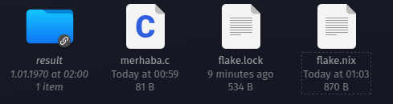
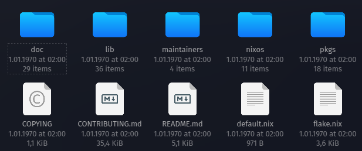
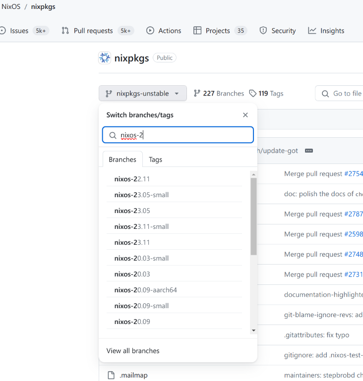

## Nix Flake Nedir? (Nix Öğreniyoruz 6)

[Nix Flake](https://nix.dev/concepts/flakes), Nix dilindeki paketleri, modülleri ve konfigürasyonları daha etkili bir şekilde yönetmek için tasarlanmıştır. 

1. [NixOS: İşletim Sistemlerine Fonksiyonel Yaklaşım](0.NixOs.md)
2. [Nix Dili ve Özellikleri](1.NixLanguage.md)
3. [Nix Dili ile ilgili Alıştırmalar](2.NixLanguage-Exercises.md)
4. [Nix Dilinde Builtins Fonksiyonlar](3.NixLanguage-Builtins.md) 
5. [Nix Paket Yöneticisi](4.Nix-Package-Manager.md)
6. [Nix Paket Yöneticisi Shell, Profile Kavram ve Komutları](5.Nix-Package-Manager-Shell-Profile.md)
7. [Nix Flake Nedir?](6.Nix-Package-Flake-CustomDerivation.md)
8. [Birden Çok Paketi Aynı Repo Üzeriden Yayınlamak](7.Nix-Package-Flake-CustomDerivation-Multiple.md) 
9. [Override ve Overlay Kavramları](8.Nix-Package-Overlay-Overrride.md)
10. [Nix Paket Yöneticisi ile Developer ve Profile Ortamları Oluşturmak](9.Nix-Package-Manager-Developer-Shell-Profile.md) 
11. [Nix ile NixOs Konfigürasyonu](10.Nix-With-NixOS.md) 
12. [NixOs Module ve Option Kullanımı](11.Nix-Nixos-Modules-Options.md)
13. [NixOs Kurulumu ve Konfigürasyonu](12.Nix-NixOs-Configuration.md)
14. [NixOs'u Cloud ve Uzak Ortamlara Deploy Etmek](13.Nix-With-NixOS-Iso-Docker-Cloud.md)


Flake, özellikle projeleri ve paketleri tanımlamak, paylaşmak ve bir arada tutmak için tasarlanmış bir yapı sunar. Flake'lar kullanılarak paket oluşturma, bağımlılıkları yönetme ve dağıtma işlemleri standart hale getirilmiş oluyor. Flake'leri tam karşılığı olmasa da NodeJs'deki gibi package.json dosyası veya dotnet'deki csproj dosyasına benzetebiliriz. Flake  biraz daha geniş kapsamlı bir kavram bir nevi hem proje dosyamız hem de çalıştırılabilir kodlarımızın olduğu bir yapıdır.


Flake yapısı ile Nix eko sisteminde bir çok yeni komut ve özellikler de eklenmiş oluyor. Eski komutların neredeyse hepsi değişmiş veya yeni komutlar ile birleştirilmiş.

Bir paket oluşturacak önce flake.nix oluşturuyoruz ve onun arkasında geliştirdiğimiz bir çok nix dosyasını kullanarak derivation oluşturup bunu build alıyoruz. Bu sayede nix paketimiz oluşuyor. Ancak artık yeni versiyonda ileride göreceğimiz NixOS konfigürasyonunu yaparken kullandığımız konfigürasyon dosyaları bile artık flake'in bir modülü durumunda.  

Flake dediğimiz şeyde aslında halen bir nix dosyası. Sadece belli bir formatta ve belirli bazı modülleri kullanarak oluşturulmuş bir nix dosyası. Daha fazla detay için şuan 2.8 versiyon için [şu resmi sayfayı](https://nix.dev/manual/nix/2.18/command-ref/new-cli/nix3-flake) inceleyebilirsiniz.


### Temel Flake Komutları

- nix flake clone: Flake repo'sunu klonlar.
- nix flake info: Flake metadata verileri gösterir.
- nix flake init: Aktif dizinde flake oluşturur.
- nix flake lock: Lock dosyası oluşturur. Bu bildiğimiz NodeJs deki package-lock.json dosyası ile aynı işi yapar.
- nix flake new: Hazır template'leri kullanarak yeni bir flake oluşturur.
- nix flake show: Flake output'unu gösterir.
- nix flake update: Flake lock dosyasını günceller.
- nix flake archive: Flake'i ve bütün input'larını Stor'a kopyalar.
- 


Flake dosyasının standart bir şeması var. Şimdilik basit Bir Flake dosyasını inceleyelim. C dilinde yazılmış basit bir uygulamayı paketleyen (yani derivation) nix kodu. Daha detaylı flake anlatımı için [şu linki](https://nixos.wiki/wiki/Flakes#Flake_schema) ve  ziyaret edebilirsiniz.


```nix
{
  description = "A flake for building Hello World";

  inputs.nixpkgs.url = "github:NixOS/nixpkgs/nixos-20.03";

  outputs = { self, nixpkgs }: {

    packages.x86_64-linux.default = with import nixpkgs { system = "x86_64-linux"; };
            stdenv.mkDerivation {
                        name = "hello";
                        src = self;
                        buildPhase = "gcc -o hello ./hello.c";
                        installPhase = "mkdir -p $out/bin; install -t $out/bin hello";
                    };

              };
}

```

Bu Flake kodu, "Hello World" adlı basit bir C programını derleyip kurmak için bir Nix Flake'ini temsil eder. Kodu adım adım inceleyelim:

1. **description:** Flake'in kısa bir açıklaması. Bu durumda, "Hello World" programını derlemek için bir Flake oluşturduğunu belirtir.

2. **inputs.nixpkgs.url:** Bu, Flake'in bağımlılıklarından biri olan `nixpkgs`'in kaynak konumunu belirtir. Bu örnekte, `nixos-20.03` branch'ini GitHub üzerinden alır.

3. **outputs:**  fonksiyonu, self ve nixpkgs'i parametre olarak alır. Yani, self ve nixpkgs fonksiyona giriş parametreleridir ve fonksiyonun içinde bu parametreler kullanılarak çıktılar üretilir.

4. **packages.x86_64-linux.default:** Bu, çıktının bir parçası olan bir paketin tanımlandığı bölümdür. Bu paket, `x86_64-linux` sistem için derlenmiş bir `hello` adlı basit bir programdır.

   - **with import nixpkgs { system = "x86_64-linux"; }:** `nixpkgs`'i belirli bir sistemle (burada x86_64-linux) içe aktarır ve onu kullanılabilir hale getirir.

   - **stdenv.mkDerivation {...}:** Bir türetilmiş (derivation) ifadesini başlatır ve gerekli özellikleri belirtir. Diğe bir versiyonu daha basit hali **builtins.derivation** fonksiyonudur.  ise Standart Environment'ın kısaltmasıdır. Paket için gerekli olan environment'i ifade eder. Biz bu örnek flake'de buildPhase ve installPhase kullandık ancak daa bir çok safha var tabii ki. Hem standard environment hem de diğer safhalar için [NisOs manual](https://nixos.org/manual/nixpkgs/stable/) sayfasındaki [Standard Environment](https://nixos.org/manual/nixpkgs/stable/#part-stdenv) ve [Phases](https://nixos.org/manual/nixpkgs/stable/#sec-stdenv-phases) sayfalarını kesinlikle incelemenizi öneririm. 

     - **name:** derivation adı, bu durumda "hello".
     
     - **src:** Kaynak dosyaların bulunduğu dizin. Bu örnekte `self` ifadesi, bu flake'in bulunduğu dizini ifade eder.

     - **buildPhase:** Derleme aşamasını tanımlar. Bu durumda, `gcc` kullanılarak `hello.c` dosyasının derlenmesini sağlar.

     - **installPhase:** Kurulum aşamasını tanımlar. Derlenen `hello` programını çıktı dizinine kopyalar.

Bu Flake, `nix flake build` komutu kullanılarak derlenebilir. Derleme sonucunda hello adında bir uygulama (paket) oluşur.  

Flake şeması detayları hakkında [Şu sayfayı](https://nixos.wiki/wiki/Flakes#Basic_project_usage) da ziyaret edeblirsiniz.


Tabi flake dediğimiz kurgu bu kadar yalın olmuyor. Ayrıca içine yüzlerce bağımlılık alan hatta onlarca lokal nix modülü import eden flake'ler yazılıyor. 

Bir flake output olarak alttakileri üretebilir.

- Nix Paketleri
- Nix Geliştirme Ortamları
- NixOS Modülleri (Nix Configuration)
- Nix Template'leri (hazır flake dosyaları)

Hepsini de vakti geldiğinde göreceğiz. Şimdilik sadece paket oluşturmayı ve Flake yapısını öğrenmeye çalışalım.

## Flake Oluşturma


Basitden karmaşığa doğru gidelim. Önce basit bir flake oluşturalım. 

Bir klasör oluşturup içine flake.nix dosyası oluşturalım. Kendim flake-first adında bir klasör oluşturup onun içine flake.nix dosyası oluşturdum. 


```nix
{
  outputs = { self }: {
    mesaj = "Merhaba Dünya!";
  };
}
```

Yazılabilecek en küçük flake dosyası bu olabilir. Burada self kelimesi doğrudan flake'in kedisini ifade eder. Laziness için bu gereklidir. Self kelimesi sayesinde hem nested (iç içe) flake'ler oluşturulabilir Ayrıca flake içinde kendi çıktılarına (output) ve attribute'larına (özellik) erişim sağlanabilir.

Şimdi kodumuzu bir test edelim. Bunun  için alttaki komutu kullanabiliriz. Eval komutu aslında nix expression'ları değerlendirmek için kullanılır. Dolayısıyla bizim kodumuz da bir nix expression.

```bash
nix eval .#mesaj

# sonuç
#"merhaba dünya"

```

Yavaş yavaş kosumuzu geliştirelim.

```nix

{
  inputs = {
    nixpkgs.url = "github:nixos/nixpkgs";
  };

  outputs = { self, nixpkgs }: {
    mesaj = "Merhaba Dünya!";
  };
}

```
ÖZel birşey yapmadığımız için kodu çalıştırdığımızda bir değişiklik olmayacaktır. 

Şimdi basit bir uygulamayı build alıp çalıştırmayı deneyelim.

Örneklerde en çok kullanılan hello world uygulamasını kullanacağız. 

Bir klasör oluşturup (ben merhaba adında oluşturdum). Daha sonra klasöre merhaba.c adında bir dosya oluşturalım ve içine alttaki kodları kopyalayalım.

```c
#include <stdio.h>

int main() {
    printf("Merhaba Dünya!\n");
    return 0;
}
```

Aynı dizine flake.nix dosyası oluşturup içine alttaki kodları kopyalayalım.

```nix
{
  description = "Merhaba Dünya! için flake";

  # input olarak nixpkgs'i alıyoruz.
  inputs = {
    nixpkgs.url = "github:nixos/nixpkgs";
  };

  # output olarak self ve nixpkgs'i alıyoruz.
  outputs = { self, nixpkgs }: {

    # bu standart olarak kullanılmalı. flake şemasının zorunlu tuttuğu bir attribute
    packages.x86_64-linux.default = with import nixpkgs { system = "x86_64-linux"; };

    stdenv.mkDerivation {
                         name = "merhaba";
                         src = self;
                         buildPhase = "gcc -o merhaba ./merhaba.c";
                         installPhase = "mkdir -p $out/bin; install -t $out/bin merhaba";

    };
}
```

Kodumuzu çalıştırmadan önce neler döndüğüne bakalım.

- **nixpkgs.stdenv.mkDerivation**: Bu, bir türetilmiş (derivation) ifadesini başlatır ve gerekli özellikleri belirtir. Bu fonksiyonun içindeki özellikler şu şekilde: 
  - **name**: derivation adı, bu durumda "merhaba".
  - **src**: Kaynak dosyaların bulunduğu dizin. Bu örnekte self ifadesi, bu flake'in bulunduğu dizini ifade eder.
  - **buildPhase**: Derleme aşamasını tanımlar. Bu durumda, gcc kullanılarak merhaba.c dosyasının derlenmesini sağlar.
  - **installPhase**: Kurulum aşamasını tanımlar. Derlenen merhaba programını çıktı dizinine kopyalar.
  - **builder**: Burada yok ancak istersek builder için bir executable tanımlayabiliriz. Mesela bash'i kullanıp ona bir script'i (args) parametre olarak geçirebiliriz.
  - **args**: builder için gerekli olan diğer parametreler mesela bir script dosyası. Eğer Docker hakkında bilginiz varsa bunu entrypoint.sh gibi düşünebilirsiniz. Daha fazla detay için [şu sayfayı](https://nixos.org/guides/nix-pills/generic-builders) ziyaret edebilirsiniz. Ayrıca nixpkgs altında bulunan builder'ları da şu [resmi Github sayfasında](https://github.com/NixOS/nixpkgs/tree/master/pkgs/stdenv/generic) görebilirsiniz.
  ```nix
    builder = "${pkgs.bash}/bin/bash";
    args = [ ./hello_builder.sh ];
  ```
- **packages.x86_64-linux.default**: Bu zorunlu bir attribute. x86_64-linux kısmı build aldığımız sisteme göre değişiklik gösterir yani hedef sistemimize göre buraya uygun sistem adını yazmalıyız. Örneğin aarch64-apple-darwin14, aarch64-pc-linux-gnu, x86_64-w64-mingw32, aarch64-apple-ios.


Artık bir uygulamamız var. Build almadan çalıştıramayız haliyle. Amacımız uygulamamızı flake üzerinden sadece build almak. Bunun için `nix build` komutunu çalıştırıyoruz. Komut çalıştıktan sonra klasöre gidip baktığımızda alttaki gibi merhaba adında bir klasör ve bir de flake.lock adında bir dosya göreceğiz.



Result klasöründe uygulamamızın binary'sini görebilirsiniz. Uygulamamızı doğrudan bu dizinden çağırabiliriz.

```bash
./result/bin/merhaba
# Merhaba Dünya!
```


Yada daha önce gördüğümüz `nix shell` komutu ile de çağırabiliriz.

```bash
nix shell --command merhaba
# Merhaba Dünya!
```


Lock dosyası ise Nix ve Nix Flake bağlamında, kilit dosya (lock file), bir derleme sırasında kullanılan bağımlılıkların tam sürümlerini kaydetmek için kullanılan bir mekanizmadır. nix build komutunu çalıştırdığınızda, Nix, derlemenin her seferinde belirli bağımlılıkların kullanıldığından emin olmalıdır. Kilit dosyası, bu sürümleri belirli bir işleme sabitleyerek bu amaca hizmet eder. Tabi bizim paketimizde henuz ciddi bir bağımlılık yok ancak örnek flake dosyalarını incelerseniz bağımlılık versiyonlarının ne kadar önemli olduğunu anlayabilirsiniz. Zaten eğer bir yazılım geliştiriciyseniz bunu çom defa deneyimlemişsinizdir.

Lock dosyası sayesinde sistem çıktıları cache'leyebilir. Girdilerde mesela bir değişiklik yoksa sistem bazı adımları cache'den çalıştırabilir. Diyelim ki flake.ini dosyasında bazı değişiklikler yaptık. Eğer sistem build alırken bu değişiklikleri görmezse `nix flake update` komutunu çalıştırmayı unutmayın. Zaten update yapıp tekrar build alırsanız sürenin tekrar uzadığını görebilirsiniz.

İleride işimize yarayacak bazı flake komutlarına bakalım. Flake yazmaya devam edeceğiz bu arada, daha karmaşık flake'ler yazacağız.

Az önce yazdığımız flake dizininde alttaki komutları çalıştıralım.

- **nix flake show**: Build alınan uygulamanın paket bilgilerini gösterir.


```bash
nix flake show

# alttaki gibi bir sonuç görmeniz lazım

path:.../flake-merhaba?lastModified=1705065665&narHash=sha256-uvTQB%2ByMrr/2qA0OseVV/8FYeGIA31RUTG9%2Bhql7WmU%3D
└───packages
└───x86_64-linux
└───default: package 'merhaba'
```

Bu ekrana bakarak mesela alttaki komutları çalıştırabiliriz.

```bash
nix run .#default
# Merhaba Dünya!

# shell ile kurulum yapıyoruz
nix shell .#default
# merhaba uygulamasını çalıştırıyoruz
merhaba
# Merhaba Dünya!
```


- **nix flake metadata**: flake dosyasındaki metadata verileri ve lock dosyasındaki metadata verilerini gösterir.
```bash
nix flake metadata

Resolved URL:  path:...flake-merhaba
Locked URL:    path:.../flake-merhaba?lastModified=1705065665&narHash=sha256-uvTQB%2ByMrr/2qA0OseVV/8FYeGIA31RUTG9%2Bhql7WmU%3D
Description:   Merhaba Dünya! için flake
Path:          /nix/store/m2wlbd9g2yzagxv4zhv7rx8n4n3wwlvg-source
Last modified: 2024-01-12 16:21:05
Inputs:
└───nixpkgs: github:nixos/nixpkgs/c6b7be9ad761d5e74bf3132971e155d41c91925d
```

Şimdi başka bir hazır flake'i kendi flake'imizde kullanalım. Başka bir klasörde deneyelim. Ben merhaba-hello adında bir klasöre alttaki kodu bir flake.nix dosyasına kopyaladım. Ancak önceki örneğimizden `merhaba.c` dosyamızı da alıp bu klasöre koymalıyız.


```nix
{
  description = "Merhaba Dünya! için flake";

  # input olarak nixpkgs'i alıyoruz.
  inputs = {
    nixpkgs.url = "github:nixos/nixpkgs";
  };

  # output olarak self ve nixpkgs'i alıyoruz.
  outputs = { self, nixpkgs }: {

    # bu standart olarak kullanılmalı. flake şemasının zorunlu tuttuğu bir attribute
    packages.x86_64-linux.default = with import nixpkgs { system = "x86_64-linux"; };

    stdenv.mkDerivation {
                         name = "merhaba";
                         src = self;
                         buildPhase = "gcc -o merhaba ./merhaba.c";
                         installPhase = "mkdir -p $out/bin; install -t $out/bin merhaba";

    };

    packages.x86_64-linux.hello = nixpkgs.legacyPackages.x86_64-linux.hello;


};
}
```

Şimdi build alıp bir çıktılarına bakalım


```nix
nix build

nix flake show

path:.../flake-merhaba?lastModified=1705068716&narHash=sha256-HztHa%2BdkFp2jYbItkr9llJy7bBSsKYj1EqkvsndIji8%3D
└───packages
└───x86_64-linux
├───default: package 'merhaba'
└───hello: package 'hello-2.12.1'
```

O zaman hello paketini çağırabiliriz.

```bash
nix run .#hello

# Hello, world!
```

Peki o zaman şunu soralım kendimize. Eğer `nix flake show` komutu bir flake'in bilgilerini gösteriyorsa biz nixpkgs'yi de bu şekilde inceleyebilir miyiz? Sonuçta şunu demiştik nixpkgs'de aslında bir flake. 

```bash
nix flake show github:NixOS/nixpkgs

github:NixOS/nixpkgs/391d29cb04fe2ca9a4744c10d6b8a7783f6b0f6d
├───checks
│   └───x86_64-linux
│       ├───nixosSystemAcceptsLib: derivation 'nixos-system-nixos-24.05.20240112.391d29c'
│       └───tarball: derivation 'nixpkgs-tarball-24.05pre20240112.391d29c'
├───htmlDocs: unknown
├───legacyPackages
│   ├───aarch64-darwin omitted (use '--legacy' to show)
│   ├───aarch64-linux omitted (use '--legacy' to show)
│   ├───armv5tel-linux omitted (use '--legacy' to show)
│   ├───armv6l-linux omitted (use '--legacy' to show)
│   ├───armv7l-linux omitted (use '--legacy' to show)
│   ├───i686-linux omitted (use '--legacy' to show)
│   ├───mipsel-linux omitted (use '--legacy' to show)
│   ├───powerpc64le-linux omitted (use '--legacy' to show)
│   ├───riscv64-linux omitted (use '--legacy' to show)
│   ├───x86_64-darwin omitted (use '--legacy' to show)
│   └───x86_64-linux omitted (use '--legacy' to show)
├───lib: unknown
└───nixosModules
├───notDetected: NixOS module
└───readOnlyPkgs: NixOS module
```

Sonuçlara baktığımızda legacyPackage'lar için komuta --legacy etiketini eklememiz gerektiğini görüyoruz. Sonuçta benim amacım hello paketini listede görmek.

```bash
nix flake show github:NixOS/nixpkgs --legacy
```

Komutu bu şekilde çalıştırdığımızda listenin ekrana sığmasına imkan yok. O yüzden filtreleme yapalım. Bunu için Nix json formatında liste veriyor. Jq kullanarak filtreleme yapabiliriz. 

```bash

nix flake show --json github:NixOS/nixpkgs --legacy|jq '.legacyPackages."x86_64-linux" | with_entries(select(.key | contains("hello")))'

# SONUÇ

warning: legacyPackages.aarch64-darwin omitted (use '--all-systems' to show)
warning: legacyPackages.aarch64-linux omitted (use '--all-systems' to show)
warning: legacyPackages.armv5tel-linux omitted (use '--all-systems' to show)
warning: legacyPackages.armv6l-linux omitted (use '--all-systems' to show)
warning: legacyPackages.armv7l-linux omitted (use '--all-systems' to show)
warning: legacyPackages.i686-linux omitted (use '--all-systems' to show)
warning: legacyPackages.mipsel-linux omitted (use '--all-systems' to show)
warning: legacyPackages.powerpc64le-linux omitted (use '--all-systems' to show)
warning: legacyPackages.riscv64-linux omitted (use '--all-systems' to show)
warning: legacyPackages.x86_64-darwin omitted (use '--all-systems' to show)
{
"hello": {
"description": "A program that produces a familiar, friendly greeting",
"name": "hello-2.12.1",
"type": "derivation"
},
"hello-unfree": {
"description": "An example package with unfree license (for testing)",
"name": "example-unfree-package-1.0",
"type": "derivation"
},
"hello-wayland": {
"description": "Hello world Wayland client",
"name": "hello-wayland-unstable-2023-10-26",
"type": "derivation"
}
}


```
Listede ilk sıradaki paket bizim yukarıda çağırıp kullandığımız hello paketi. Versiyonunu da 2.12.1 olarak görüyoruz.


Birde nixpkgs'nin metadata'sına bakalım.

```bash
nix flake metadata  github:NixOS/nixpkgs

Resolved URL:  github:NixOS/nixpkgs
Locked URL:    github:NixOS/nixpkgs/e52366c4d82286ccb62bd6812e370141466d53c0
Description:   A collection of packages for the Nix package manager
Path:          /nix/store/jqypdy1dcvlz7i9qlgd7g5wvmjknzs6f-source
Revision:      e52366c4d82286ccb62bd6812e370141466d53c0
Last modified: 2024-01-14 16:17:14

```

Lokal makinemde nixpkgs `/nix/store/jqypdy1dcvlz7i9qlgd7g5wvmjknzs6f-source` dizininde görünüyor. Bu dizine gittiğimizde nixpkgs'nin bütün kodlarını görebiliriz. 



Yani aslında nixpkgs de bizim yazdığımız flake'ler gibi bir flake. Tek farkı bütün paketleri içinde barındırıyor olması. Dolayısıyla neredeyse her gün commit alıyor. Mesele NixOs kullanıyor olsaydık onunla ilgili repoları'da yine buradan kullanacaktık.



Biz aslında nixpkgs kullandığımızda sistem onu GitHub'dan indirip kullanıyor. Dolayısıyla yukarıda hello paketini aradığımız kodu şu şekilde de çalıştırabiliriz. Sonuç aynı olacaktır.

```bash
nix flake show --json /nix/store/jqypdy1dcvlz7i9qlgd7g5wvmjknzs6f-source --legacy|jq '.legacyPackages."x86_64-linux" | with_entries(select(.key | contains("hello")))'

```


Kod standartları için resmi repo'sunda yer alan contribution sayfasındaki [Code Convention](https://github.com/NixOS/nixpkgs/blob/master/CONTRIBUTING.md#code-conventions) sayfası örnek olabilir.


## Git Üzerinden Kaynak Kodu Almak


Şimdiki örneğimizde C ile yazmış oluğumuz kodu GitHıb üzerinden alıp build alacağız. Kendim message adında bir klasöre flake.nix dosyamı oluşturup alttaki kodları kopyaladım. Github'a nasıl kod konulur ve nasıl tag atılır vb konulara burada girmemiz çok mümkün değil. Zaten konuyla akalı bir çok kaynak bulabilirsiniz. Kendim ufak bir uygulama koydum kendi Github hesabıma size onu kullanabilirsiniz ilk testlerinizde.


```nix

 
# flake.nix

{
  description = "Simple Message App with C";

  inputs = {
    nixpkgs.url = github:NixOS/nixpkgs/nixos-unstable;
  };

  outputs ={ self, nixpkgs, ... }:

    let

      simpleMessageAppSrc = "https://github.com/muratcabuk/simple-message-app-with-c/archive/refs/tags/v1.0.tar.gz";

      # Simple Message App'in kaynak dizini
      src = builtins.fetchTarball {
        url = simpleMessageAppSrc;
        sha256 = "sha256:1aai9xdkgq2vd0ch10gxhg53qfv4ny2x3jgxlq4r9nrn4g9r8s1z";
      };

       # Programı derleme komutu
      buildCommand = ''
                        gcc -o simple-message-app ${src}/message.c
                     '';

    in
    {

      packages.x86_64-linux.default = with import nixpkgs { system = "x86_64-linux"; };

      stdenv.mkDerivation {
        name = "simple-message-app";
        version = "v1.0";
        src = src;
        buildInputs = [ gcc ];
        nativeBuildInputs = [ autoconf libtool makeWrapper ];
        buildPhase = buildCommand;
        installPhase = "mkdir -p $out/bin; install -t $out/bin simple-message-app";

        meta = with nixpkgs.lib; {
          description = "Simple Message App with C";
          license = licenses.mit;
          version = "v1.0";
        };
      };


    };
}


```

Kodda GitHub'dan release edilmiş kodları aldığımız için fetchTarball kullandık ama diğerleri de hatta alttakilerden daha fazlası da mevcut.


- **builtins.fetchGit**: Git repo'larından dosya indirmek için kullanılır. Mesela her zaman en sürümü almak için kullanılabilir.
- **builtins.fetchClosure**: Nix store'da bulunan bir dosyayı indirmek için kullanılır.
- **builtins.fetchTarball**: Tarball dosyalarını indirmek için kullanılır.
- **builtins.fetchurl**: URL'den dosya indirmek için kullanılır.

Builtins fonksiyonları dışında da nixpkgs altında  daha bir çok fonksiyon bulunmaktadır. [Şu sayfadan](https://nixos.org/manual/nixpkgs/stable/#chap-pkgs-fetchers) bakabilirsiniz.


- fetchDebianPatch
- fetchsvn
- fetchgit
- fetchcvs
- fetchFromGitea
- fetchFromGitHub
- fetchFromGitLab
- fetchFromGitiles
- fetchFromBitbucket
- fetchFromSavannah
- fetchFromRepoOrCz
- fetchFromSourcehut
- requireFile
- fetchtorrent


Şimdi kodumuzu built alıp test edelim.

```bash
nix build --impure
nix run .#default
# sonuşta size bir kelime sorup onu ekrana yazacak

```

Ancak bu haliyle kodumuz genişleyebilir ve kullanışlı değil. Ayrıca tabi burada çok karmaşık işler yapmıyoruz ancak hakikaten ciddi bir uygulamayı paket yapıyor olsak belki onlarca bağımlılık ve build ve deploy işlemleri için yüzlerce satır yazmamız gerekebilirdi. Bundan dolayı daha moduler yazmak işimizi kolaylaştıracaktır. 

Mesela derivative oluşturma kısmını biraz daha parametrik yazsak her versiyonda kullanabilir. Şu haliyle kodumuz sadece tek bir versiyon için kullanılabilir görünüyor. Eğer paketimizi her zaman en son versiyonu build alacak şekilde yazsaydık o zaman bu kod işimizi görebilirdi. Tabi o zaman release edilmiş bir tar dosyasını değilde doğrudan örneğim master branch'in en son commit'ini kullanabilirdik. 

Şimdi Bunun için yeni bir klasör (message-second) açıyorum ve öncelikle derivative kısmını ayırmak için alttaki kodları `derivation.nix` adında bir dosya oluşturup kopyalıyorum.

Daha önceki derslerden hatırlayabileceğimiz üzere bu bir fonksiyon tanımı. Bu sayede daha karmaşık süreçleri yönetmemiz kolaylaşacak.

```nix
# derivation.nix
{pkgs, stdenv, gcc, selectedVersion, ...}:


    let

simpleMessageAppSrc = "https://github.com/muratcabuk/simple-message-app-with-c/archive/refs/tags/${selectedVersion.version}.tar.gz";

      shaSet = {v10="sha256:1aai9xdkgq2vd0ch10gxhg53qfv4ny2x3jgxlq4r9nrn4g9r8s1z";
                v20="sha256:11p3c793yjpm4z4j9shlidbii7wd0kf9qflx8jqhhnwwhqf93mam";
                v30="sha256:1a4a2i32da9shc2d3i1ndarmla97bald7lgs1vjmwyjlry0mk4m7";};

      shaVer = builtins.concatStringsSep "" (pkgs.lib.strings.splitString "." "${selectedVersion.version}");


      versionSha = builtins.getAttr shaVer shaSet;

      # Simple Message App'in kaynak dizini
      src = builtins.fetchTarball {
        url = simpleMessageAppSrc;
        sha256 = versionSha;
      };

    in
        stdenv.mkDerivation (finalAttrs: {
              name = "simple-message-app";
              version = "${selectedVersion.version}";

              src = src;

              buildInputs = [ gcc ];
              buildPhase = "gcc -o simple-message-app ${src}/message.c";
              installPhase = "mkdir -p $out/bin; install -t $out/bin simple-message-app";

              meta = with pkgs.lib; {
                    description = "Simple Message App with C";
                    license = licenses.mit;
                    version =  "${selectedVersion.version}";
                };
        })

```

Kod aslında çok karmaşık değil. Verilen versiyon numarasına göre tar dosyası için gerekli hash üretiliyor ve kod indirilip build aşamasına kaynak kodu src parametresi ile taşınıyor.

Bir tane de `flake.nix` adında br dosya oluşturup alttaki kodları da ona kopyaladım.

```nix
# flake.nix
{
  description = "Simple Message App with C";

  inputs = {
    nixpkgs.url = "github:nixos/nixpkgs/nixos-unstable";
  };

  outputs ={ self, nixpkgs, ... }:
    let

      derivation = import ./derivation.nix;
      selectedVersion = {version = "v1.0";};

    in
    {
      packages.x86_64-linux.default = with import nixpkgs { system = "x86_64-linux"; config.allowUnfree = true; };

      derivation {pkgs = import nixpkgs { system = "x86_64-linux"; config.allowUnfree = true; }; 
                  stdenv = stdenv; gcc = gcc; 
                  selectedVersion = selectedVersion;
                  };
    };
}

```

'Derivation.nix' dosyamız bir module olarak içeri import ediliyor ve in bloğu içinde derivation fonksiyonu olarak çağrılıyor. Bu versiyonun güzel tarafı bir kere derivation fonksiyonun karmaşası başka bir modüle bırakılmış olması ve bu fonksiyonun çalışabilmesi için gerekli parametrelerin hazırlanma işinin de flake içinde halledilmiş olması. Böylece istediğimiz versiyon numarasını parametre olarak fonksiyona geçip paketimizi oluşturabiliyoruz.  

Ancak bu haliyle de kodumuz çok kullanışlı değil. Örneğin derivative sürecini yöneten fonksiyonumuz neden ilgili versiyonun kaynak kodunu indirme sürecini de yönetiyor? yani kaynak kod derivation için bir girdi aslında. Her yeni versiyon için bu kodu değiştirmek zorunda kalacağız. Ayrıca birde diyelim ki versiyonda bir güncelleme oldu yine bu kodu değiştirmek zorunda kalacağız çünkü kod değişince hash de değişmiş olacak. Daha dinamik bir yapı kursak daha olacak gibi.  

Bunun için yeni bir klasör oluşturalım adı message-third olsun. Daha sonra alttaki kodları `derivation.nix` adında bir dosyaya kopyalayalım.

```nix
# derivaiton.nix
{pkgs, stdenv, gcc, selectedVersion, src, ...}:

    let

    # Simple Message App'in kaynak dizini
      srcDrv = src;


    in
        stdenv.mkDerivation (finalAttrs: {
              name = "simple-message-app";
              version = "${selectedVersion.version}";

              src = srcDrv;

              buildInputs = [ gcc ];
              buildPhase = "gcc -o simple-message-app ${src}/message.c";
              installPhase = "mkdir -p $out/bin; install -t $out/bin simple-message-app";

              meta = with pkgs.lib; {
                    description = "Simple Message App with C";
                    license = licenses.mit;
                    version =  "${selectedVersion.version}";
                };
        })


```
Flake.nix içinde alttaki kodu kullanıyoruz.

```nix
# flake.nix

{
  description = "Simple Message App with C";

  inputs = {
    nixpkgs.url = "github:nixos/nixpkgs/nixos-unstable";
  };

  outputs ={ self, nixpkgs, ... }:
    let

      selectedVersion = {version = "v1.0";};

      simpleMessageAppSrc = "https://github.com/muratcabuk/simple-message-app-with-c/archive/refs/tags/${selectedVersion.version}.tar.gz";

      shaSet = {v10="sha256:1aai9xdkgq2vd0ch10gxhg53qfv4ny2x3jgxlq4r9nrn4g9r8s1z";
                v20="sha256:11p3c793yjpm4z4j9shlidbii7wd0kf9qflx8jqhhnwwhqf93mam";
                v30="sha256:1a4a2i32da9shc2d3i1ndarmla97bald7lgs1vjmwyjlry0mk4m7";};

      shaVer = builtins.concatStringsSep "" (nixpkgs.lib.strings.splitString "." "${selectedVersion.version}");

      versionSha = builtins.getAttr shaVer shaSet;

      # Simple Message App'in kaynak dizini
      src = builtins.fetchTarball {
        url = simpleMessageAppSrc;
        sha256 = versionSha;
      };

      derivation = import ./derivation.nix;

    in
    {
      packages.x86_64-linux.default = with import nixpkgs { system = "x86_64-linux"; config.allowUnfree = true; };

      derivation {pkgs = import nixpkgs { system = "x86_64-linux"; config.allowUnfree = true; };
                  stdenv = stdenv; gcc = gcc; 
                  selectedVersion = selectedVersion;
                  src = src;};
    };
}


```

Artık derivation dosyamız kendi işine daha fazla odaklanmış oldu.

Build almayı ve çalıştırmayı biliyoruz artık tekrar yazmıyorum.

## Flake'i Github'da Yayınlamak

Github'da bir repo açıp içine message-third içindeki flake ve derivation dosyalarını upload ediyoruz. Daha sonra bu repo'yu flake olarak kullanmak için alttaki komutu çalıştırıyoruz. Ben kendi Github sayfamda https://github.com/muratcabuk/nix-examples reposunda yayınladım. Ancak siz bu makaleyi okurken main branch'deki kodlar tabi değişmiş olacak. `message-third` örneğimizdeki kodu görebilmeniz için message-third adında bir branch oluşturdum. Bu örnekte de o branch'i çağırarak kodumuz test edelim. 

Komutta github adresine eklediğimiz message-third kısmıyla branch çağırmış oluyoruz.

```bash
nix run github:muratcabuk/nix-examples/message-third --no-write-lock-file
```
Komutu çalıştırdığınızda flake.nix dosyası altında `selectedVersion = {version = "v1.0";};` hangi versiyon yazılıysa onun build alınıp çalıştırıldığını görebiliriz. 


Buraya kadar halen NixOs kullanmadık. Hala aslında Nix dilinin kıyılarında dolaşmaya devam ediyoruz. Biraz Biraz paket yönetimine girdik ama halen biraz daha yolumuz var. `nix shell` komutunu gördük ancak orada da aslında imperative bir kullanım yaptık. Yani  herhangi bir proje klasörüne girdiğimizde her defasında onlarca bağımlılığı elimizle manuel kurmamız tabii ki anlamsız olacaktır. Yada kendimize bir profile kurmak istediğimizde tek tek uygulamaları kurmak da mantıksız olacaktır. Zaten bunu bütün paket yöneticileri bu şekilde yapıyor. Nix felsefesine de zaten bu kullanım aykırı bir durum. İşte bu nedenle flake'leri ve Nix'in modüler yapısını anlamak çok önemli.Bu sayede manuel yaptığımız her şeyi bir nix dosyasına declarative bir şekilde yazabileceğiz. Ayrıca NixOs'un modüler yapısını da anlamış olacağız. 


Bir flake'in ne tür çıktılar üretebildiğini  tekrar hatırlayalım.

- Nix packages
- Nix development environments
- NixOS configurations
- Nix templates


Dolayısıyla bir profile oluştururken veya NixOs için bir konfigürasyon ve paket yönetimi oluşturmak istediğimizde karmaşayı yönetmek için modüler bir yapıya ihtiyacımız olacak. Dolayısıyla sadece bir paketi bir GitHub reposunda yayınlamaktan daha fazlasını yapabiliyor olamamız gerekiyor.

Kendimize bi NixOs ortamı veya bir profile oluşturmak istediğimizde aslında bir çok paketin bir arada çalıştığını göreceğiz. Bu paketlerin birbirleriyle uyumlu çalışması için bir çok parametreyi bir arada yönetmemiz gerekecek. Bu nedenle bir çok paketi bir arada yönetebileceğimiz bir yapıya ihtiyacımız olacak. Şimdi elimizdeki repoyu yazı devam ederken devamlı geliştirip değiştireceğiz.

Elimizdeki message uygulaması için repomuzda bir message-app adında bir klasör oluşturup flake.nix ve derivation.nix dosyalarını içine taşıyoruz. Kod ileride değişeceği için message-app adında bir branch oluşturacağım. İleri de kodu incelemek istediğinizde bu branch'den bakabilirsiniz.


Şimdi artık bi branch'imiz bir de klasörümüz var. Branch adının repo adından sonra slaş ile ayırarak yazıldığını biliyoruz. Klasör çağırmak içnde `?dir=message-app` ekliyoruz.

```bash
nix run "github:muratcabuk/nix-examples/message-app?dir=message-app" --no-write-lock-file
```


- Belirli bir commit ID'si ile çağırmak için
`nix run github:repo_hesabi/repo_adi/commit_id`

- Tag ile çağırmak için
`nix run github:repo_hesabi/repo_adi/tag`

- Branch'deki en son commit ile çağırmak için
`nix run github:repo_hesabi/repo_adi/branch_adi`


Ancak tabiiki bu haliyle kurduğumuz repo bütün paketleri bir birinden bağımsız olarak sunuyor. Bu yukarı bahsettiğimiz amaçlara ulaşmamız için yeteli görünmüyor. 

Bunu için öncelikle aynı anda birden fazla paketi nasıl yayınlanabilceğini öğrenmemiz gerekiyor. Bunu da bir sonraki yazımıza bırakalım.

Bu arada eğer resmi repo'ya nasıl paket ekleyebileceğinizi merak ediyorsanız [şu sayfadan](https://github.com/NixOS/nixpkgs/blob/master/pkgs/README.md) bakabilirsiniz.


# Kaynaklar
- https://zero-to-nix.com/concepts/flakes
- https://serokell.io/blog/practical-nix-flakes
- https://nixos.wiki/index.php?title=Flakes
- https://www.tweag.io/blog/2020-07-31-nixos-flakes/
- https://nixos.wiki/wiki/Flakes#Introduction
- https://determinate.systems/posts/nix-run
- https://nixos.wiki/wiki/Flakes
- https://ertt.ca/nix/shell-scripts/
- https://fasterthanli.me/series/building-a-rust-service-with-nix/part-10
- https://nix.dev/tutorials/file-sets.html
- https://nixos.wiki/wiki/Nix_Cookbook#Wrapping_packages
- https://nixos.org/manual/nixpkgs/stable/#part-stdenv
- https://ryantm.github.io/nixpkgs/builders/trivial-builders/
- https://serokell.io/blog/practical-nix-flakes#basic-flake-structure
- https://lantian.pub/en/article/modify-computer/nixos-packaging.lantian/
- https://github.com/samdroid-apps/nix-articles
- https://github.com/djhshih/biopkgs/tree/master
- https://nixos.wiki/wiki/Nixpkgs/Create_and_debug_packages
- https://nixos.org/guides/nix-pills/generic-builders