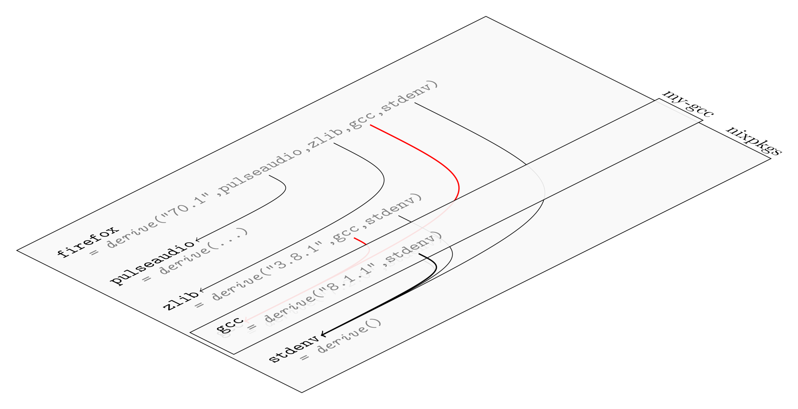
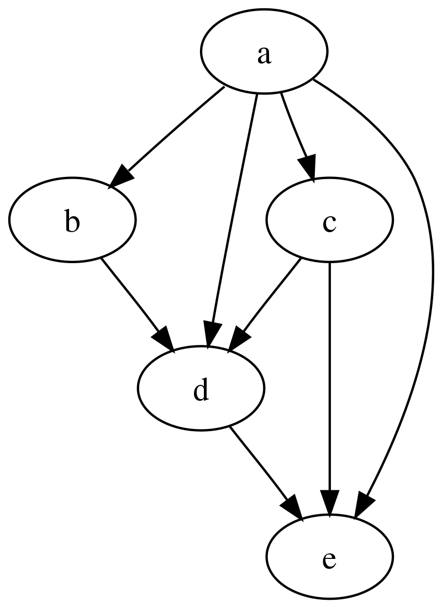
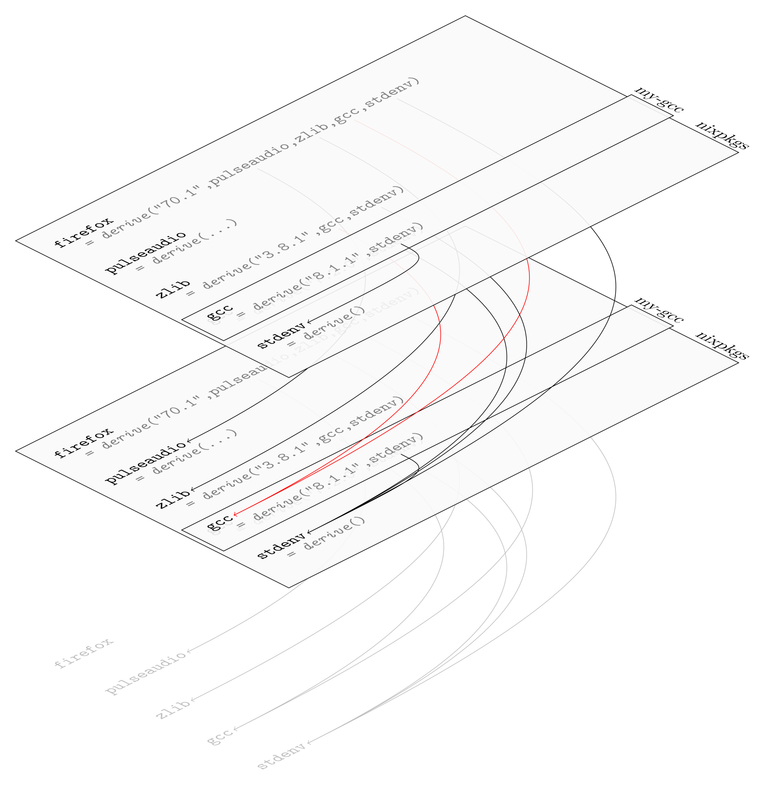

## Override ve Overlay (Nix Öğreniyoruz 8)

Override'in Türkçe geçersiz kılmak anlamına geliyor. Nix dilinde paketlerin ve paket setlerinin değiştirilmesi ve genişletilmesi için kullanılan iki önemli kavramdır. Bir modül veya bir paketin bazı özelliklerini değiştirerek, silerek veya yeni özellikler ekleyerek daha esnek paket yönetimi yapmamıza olanak tanırlar.

1. [NixOS: İşletim Sistemlerine Fonksiyonel Yaklaşım](0.NixOs.md)
2. [Nix Dili ve Özellikleri](1.NixLanguage.md)
3. [Nix Dili ile ilgili Alıştırmalar](2.NixLanguage-Exercises.md)
4. [Nix Dilinde Builtins Fonksiyonlar](3.NixLanguage-Builtins.md) 
5. [Nix Paket Yöneticisi](4.Nix-Package-Manager.md)
6. [Nix Paket Yöneticisi Shell, Profile Kavram ve Komutları](5.Nix-Package-Manager-Shell-Profile.md)
7. [Nix Flake Nedir?](6.Nix-Package-Flake-CustomDerivation.md)
8. [Birden Çok Paketi Aynı Repo Üzeriden Yayınlamak](7.Nix-Package-Flake-CustomDerivation-Multiple.md) 
9. [Override ve Overlay Kavramları](8.Nix-Package-Overlay-Overrride.md)
10. [Nix Paket Yöneticisi ile Developer ve Profile Ortamları Oluşturmak](9.Nix-Package-Manager-Developer-Shell-Profile.md) 
11. [Nix ile NixOs Konfigürasyonu](10.Nix-With-NixOS.md) 
12. [NixOs Module ve Option Kullanımı](11.Nix-Nixos-Modules-Options.md)
13. [NixOs Kurulumu ve Konfigürasyonu](12.Nix-NixOs-Configuration.md)
14. [NixOs'u Cloud ve Uzak Ortamlara Deploy Etmek](13.Nix-With-NixOS-Iso-Docker-Cloud.md)

Bunu yapmak için Nix hem builtins hem de nixpkgs içindeki lib kütüphanelerinde bir çok fonksiyon sunar. Aslında tanım olarak kolay ancak uygulaması biraz karmaşık daha doğrusu nerede ve nasıl yapacağımızı anlamak ve bulmak biraz zor. 


Bir de hatırlatma yapayım. İlk yazılarımızda hatırlarsanız Nix dilinin immutable (yani değiştirilemez) olduğundan bahsetmiştik. Fonksiyonel programlama dillerinde kod yazmış olanlar buna zaten aşinadır. Yada son zamanlarda yükselişte olan Rust dili de yine immutable değişkenlere sahiptir aksi belirtilmedikçe. Bunun bir çok faydası var ama şuan konumuz bu değil. Asıl vurgulamak istediğim Nix dilinde aslında bir set'in değerlerini aslında silemeyiz veya değiştiremeyiz. Burada yapılan yeni bir set oluşturmaktır aslında. Özellikle OOP dünyasından gelen arkadaşların buna bende dahil alışması biraz zaman alıyor bu duruma. Normalde bir liste elemanını Java veya C# dillerinde  değiştirmek çok kolaydır. Ancak burada her şey fonksiyon dolayısıyla biz donen her değeri başka bir değişkene atarken değiştiriyoruz. Bundan dolayı override ve overlay işlemleri için Nix dilinde farklı farklı fonksiyonlar. Amaçları bu işlemleri yapabilmemizin muhtemel olduğu yerlerde işimizi kolaylaştırmak. 

Bu durumda override etmeyi düşündüğümüz veri tipini bilmemiz gerekiyor. Bir set ile mesela bir string'i farklı yollarla override edebiliriz. Amacım detaya girip kafanızı karıştırmak değil sade bir override  yazmak istediğimizde nereden başlayacağımızı anlamak. Veri tipini öğrendikten sonra da ona uygulayacağımız fonksiyonu veya varsa diğer yolları bulup uygulamak. Mesela amacımız bir derivation'ı override etmekse bunun için overrideDerivation fonksiyonunu kullanabiliriz. Amacımız bir paketi override etmekse bunun için overrideAttrs veya override fonksiyonunu kullanabiliriz. Yada doğrudan bir set üzerinde işlem yapmaksa belki bir fonksiyon kullanmamıza gerek olmayabilir. İlk yazılarımızda anlattığımız setler üzerinde işlem yapma konularına bakabilirsiniz.

- **Overlay**: Birden çok paketi veya modülü override etmek için kullanılır. Tabi birden çok paketi veya modülü override edebilen tekini de edebilir.
- **Override**: Tek bir paket veya modül üzerinde değişiklik yapmak için kullanılır.

Kullanımlarımdan edindiğim sonuç overlay'ı anlamak ve uygulamak daha kolay. Ancak yine de çok spesifik durumlarda mecburen salt override kullanmamız gerekebiliyor. 

## Override


Basit uygulamalardan karmaşığa doğru gidelim. Bir klasör içinde message-app adında bir klasör açalım. Klasör içinde default.nix adında bir dosya oluşturup alttaki kodları kopyalayalım.  Ben de kendi repo'mda override-derivation adında bir klasörde bu işlemleri yapıyorum.

- **\<pkg>.overrideDerivation**:


```nix
{nixpkgs ? {}}:
        nixpkgs.stdenv.mkDerivation (finalAttrs: {
              name = "message-app";
              version = "v1.0";

              description = "merhaba dünya";

              src = builtins.fetchTarball {
                      url = "https://github.com/muratcabuk/simple-message-app-with-c/archive/refs/tags/${finalAttrs.version}.tar.gz";
                      sha256 = "sha256:1aai9xdkgq2vd0ch10gxhg53qfv4ny2x3jgxlq4r9nrn4g9r8s1z";
                    };

              buildInputs = [ nixpkgs.gcc ];
              buildPhase = "gcc -o message-app ${finalAttrs.src}/message.c";
              installPhase = "mkdir -p $out/bin; install -t $out/bin message-app";

              meta = with nixpkgs.lib; {
                    description = "Simple Message App with C";
                    license = licenses.mit;
                    version =  "${finalAttrs.version}";
                };
        })


```
message-app klasörü ile aynı dizinde flake.nix adında bir dosya açıp için alttaki kodları kopyalayalım.

```nix

{
  description = "Flake için örnek paketler";
  inputs = {
    nixpkgs.url = "github:nixos/nixpkgs/nixos-unstable";
  };

  outputs ={ self, nixpkgs, ... }:
    let
        pkgs = import nixpkgs {};

        packages = rec {
            x86_64-linux.default = (pkgs.callPackage ./message-app {version = "v1.0";}).overrideDerivation( oldAttrs: rec { version = "v3.0-preview";} );
            x86_64-linux.message-app = x86_64-linux.default;

            aarch64-linux.message-app =  import ./message-app {version = "v3.0";};
        };

    in
    {
        packages = packages;
    };
}

```

Default paketini callPackage fonksiyonu ile içeri alırken parantez içine alındığına dikkat edin. Parantez ile bu işleme öncelik verilmesini söylemiş oluyoruz. Buj fonksiyon bildiğimiz gibi bize derivative döndürüyor. Bu tipi override edebilmemiz için de Nix bize  overrideDerivation adında bir fonksiyon sunuyor. Bu fonksiyon veri olarak bir anonim fonksiyon alıyor. Bu fonksiyonun ilk parametresi olan oldAttrs ise üzerinde işlem yaptığımız derivative'in  attribute'larına erişmek için kullanılır. 

Bu örnekte oldAttrs parametresi ile version attribute'una erişip değiştirdik. Ancak dikkat ederseniz paket import ederken v1.0 dedik ama override ederken v3.0-preview kullandık. Zaten böyle bir versiyona destek vermediğimiz default.nix'den belli oluyor. Bu durumda eğer override işlemi derivation işleminden önce oluyorsa yazdığımız kod çalışmayacaktır. Versiyon 1'de hatırlarsanız uygulamamız kullanıcıdan sadece tek bir metin alıp onu ekrana yazıyordu.

```bash
nix run  .# --impure 
# komutu çalıştırdığımızda uygulama tek bir input alıp onu akrana yazacaktır.
# Yani kodumuz hata vermedi. Demek ki overrideDerivation derivate işleminden sonra çalışıyor.
```
Buradan override işleminin build işleminden sonra çalıştığını görebiliyoruz. Peki hakikaten böyle mi acaba? Yani bu durum hakikaten override işleminin build işleminden sonra çalıştığını ispat eder mi? Evet eder çünkü default.nix dosyasına bakacak olursak hakikaten versiyon bilgisini kaynak kodu çekerken kullanıyoruz. Dolayısıyla eğer sadece metadata bilgisi olarak değiştirmek istediğimiz attribute'lar varsa overrrideDerivation fonksiyonunu kullanabiliriz. Mesela hakikaten v1.0 dan paket oluşturmak istiyoruz ancak tam release olmadığı için version bilgisini değiştirmek istiyoruz. Veya adını farklı bir şekilde göstermek istiyoruz. bu gibi durumlar kullanılabilir.

- **\<pkg>.overrideAttrs**:

Bunun için sadece flake.nix dosyasını alttaki gibi değiştiriyoruz. Önce test edelim sonra da ne döndüğünü anlamaya çalışalım. Halen default.nix dosyamızda v1.0 versiyonunun yazılı olduğunu unutmayalım.

```nix
# flake

{
  description = "Flake için örnek paketler";
  inputs = {
    nixpkgs.url = "github:nixos/nixpkgs/nixos-unstable";
  };
  outputs ={ self, nixpkgs, ... }:
    let


        pkgs = import nixpkgs {};

        packages = rec {
           x86_64-linux.default = (pkgs.callPackage ./message-app {nixpkgs = pkgs;}).overrideAttrs (
                                                      finalAttrs: previousAttrs: rec{
                                                                      version = "v3.0";
                                                                      src = builtins.fetchTarball {
                                                                                url = "https://github.com/muratcabuk/simple-message-app-with-c/archive/refs/tags/${version}.tar.gz";
                                                                                sha256 = "sha256:1a4a2i32da9shc2d3i1ndarmla97bald7lgs1vjmwyjlry0mk4m7";};
                                                                                  });


            x86_64-linux.message-app = x86_64-linux.default;

            aarch64-linux.message-app =  import ./message-app {version = "v3.0";};
        };

    in
    {
        packages = packages;
    };
}

```

Alttaki gibi test ettiğimizde artık v3.0 versiyonunun kullanıldığını göreceğiz.

```bash
nix run  .# --impure
# artık v3.0 versiyonunun kullanıldığını göreceğiz.
```

Peki buradaki finalAttrs ve previousAttrs ne anlama geliyor? finalAttrs, override işlemi yapılan set'in son hali anlamına gelir. previousAttrs ise override işlemi yapılmadan önceki set'in hali anlamına gelir. Alında biz her atama yaptığımızda derivative'i değiştiriyoruz. Eğer biz değiştirmeden bir önceki değerlere ihtiyacımız varsa previousAttrs kullanıyoruz o değeri okumak için. Yada biz değiştirdikten sonraki bir değeri okumak istiyorsak finalAttrs kullanıyoruz. 

Bazı kaynaklarda finalAttrs yerine self, previousAttrs yerine super kullanıldığını görebilirsiniz. Burada bilmemiz gereken ilk parametre değiştikten sonra yeni hali, ikinci parametre ise değişmeden önceki hali temsil eder.

- **\<pkg>.override**

Nixpkgs 'de neredeyse bütün paketlerde override fonksiyonu bulunur. Yani bu durumda override fonksiyonunu kullandığımız paket bize sunuyor olmalı. Dolayısıyla şu haliyle biz kendi paketimizde override fonksiyonunu kullanamayız. Kullanımı tamamen overrideAttrs fonksiyonu ile aynı. Zaten internette bir çok örnek bulabilirsiniz. Zaten resmi dokümanlara'da bakarsanız overrideAttrs fonksiyonunun override fonksiyonundan daha çok kullanıldığını hatta önerildiğini de görebilirsiniz.


- **\<pkg>.makeOverradable**

Bu ise normal bir bir fonksiyonu override edilebilir hale getirir. Normal şartlarda Nix dilinde mkDerivative fonksiyonu da dahil bir fonksiyonu set'ler gibi override edemezsiniz. Ancak yeni bir versiyonunu yazmamız gerekir. Buna daha önce değinmiştik. MkDerivative fonksiyonu özel bir fonksiyon olduğu için dil içinde derivative üzeriden bunu override edebilmemiz mümkün kılınmış. Orada da büyük ihtimal arkada sistem aslında fonksiyonun  build alınma sürecinde yapılacaklarla ilgili derivative'deki attribute'ları değiştiriyor. Aslında biz fonksiyonu değil fonksiyonun çalışmasa sonucunda oluşan derivative değerlerini değiştiriyoruz. Yada ikinci ihtimal ki bu daha yüksek bir ihtimal sistem bizden altığı parametrelere göre yeni bir derivative oluşturuyor. Nasıl yaptığı çok önemli  değil aslında bizim için. Bizim için önemli olan fonksiyonun sonucunu değiştirebilmek.

Bazı durumlarda basit bir fonksiyonu da override edilebilir yapmamız gerekebilir. Ancak tabii ki halen bütün kurallar geçerli yani bir fonksiyon immutable'dır yani kendini veya içindeki bir parametreyi veya yaptığı işin bir kısmını doğrudan değiştiremeyiz. Burada ayarlayabildiğimiz sadece sonucu değiştirmek.

[Resmi sayfasındaki](https://nixos.org/manual/nixpkgs/unstable/#sec-lib-makeOverridable) örneği doğrudan alıyorum.

Repl içinden örneği test edebilirsiniz.

```nix
f = { a, b }: { result = a+b; };
c = lib.makeOverridable f { a = 1; b = 2; };
# c.result = 3

(c.override { a = 4; }).result 
# result 6 olacaktır
```
Gördüğümüz üzere biz aslında f fonksiyonunu override etmedik. Halen fonksiyon aynı işlemi yapıyor. Ancak elimizde ki sınucun parametre değerlieni değiştirerek farklı sonuçlar oluşurabiliyoruz. 


Buraya kadar sadece kendi yazdığımız tek  bir paketi override etmeyi öğrendik. Şimdi birde bir veya daha fazla paketi overlay ile nasıl override edebileceğimize bakalım. Ardından Nix repo'larındaki veya diğer repo'lardaki paketleri nasıl  override edebileceğimize bakalım.

## Overlay

Overlay basitçe iki parametre (final, prev veya self, super) alan ve geriye bir paket seti döndüren fonksiyondur.  

Öncelikle overlay kavramını biraz inceleyelim. Daha sonra uygulamalara geçeriz.

En basit haliyle overlay `final: prev: { f = final.<pkg>; }` şeklinde yazılır. Diğer bir şekliyle `final: prev: { f = prev.<pkg>; }` şeklinde de yazılabilir. Şu haliyle bu yazımla bir şey değiştirmiyoruz tabii ki sadece değiştirme yaparken paketin önceki haline ve son haline ulaşmak için kullanıyoruz. Alttaki kullanımla bir paketin değişimden önceki haline erişip onu değiştirip daha sonra yeni halini (final) döndürüyoruz.

```nix

final: prev: {
  pkg_name = prev.pkg_name.override { ... };
  myPackage = final.pkg_name;
}

```
Ancak mesela alttaki örnekte infinite recursion durumu oluşur. Yani sonsuz döngüye girer. Çünkü final ifadesi preview ifadesi üzerine kurulur. Eğer son durumdan (final) tekrar son durum (final) oluşturmaya çalışırsak sonsuz döngüye gireriz. 

```nix
final: prev: firefox = final.firefox.override { ... };
```

Alttaki örnekte de birden fazla paket üzerinden işlem yapılıyor. Burada da self son hali prev ise önceki hali temsil eder. 

```nix
self: super:
{
  boost = super.boost.override {
    python = self.python3;
  };
  rr = super.callPackage ./pkgs/rr {
    stdenv = self.stdenv_32bit;
  };
}
```

Alttaki örnek de ise dah önce de yaptığımız gibi bir paketin kaynağını ve versiyonu değiştiriyoruz.  

```nix
self: super: {
    <pkg> = super.<pkg>.overrideAttrs (prev: {
      version = "v2.0";
      src = pkgs.fetchFromGitHub {
        owner = "username";
        repo = "repo_name";
        sha256 = cha2560000000000000000;
      };
    });
  }
```

Örneklerden de anlayacağınız üzere en başta dediğimiz gibi `final: prev: { .......... }` şeklinde bir kalıp. Ancak hala tam olarak nedir tam olarak ne olduğu belli değil gibi. Teknik olarak evet bir fonksiyon ama ever bir override ise zaten farklı farklı fonksiyonlar var ve neden overlay diye bir isim?


Aslında overlay tam salt olarak bir override yani bir değişkeni alıp değiştirmek gibi bir işlemi yapmıyor. Override kelimesinin Türkçe karşılığı isim olarak katman, örtü ve fiil olarak örtmek, üstünü kapatmak gibi anlamlara geliyor. [Şu sayfada](https://blog.layus.be/posts/2020-06-12-nix-overlays.html) birazdan anlatacağım katman mantığını daha detaylı inceleyebilirsiniz. Görselleri ve anlatımı da aynı sayfadan aldım.


Alttaki gibi modül ile Firefox'u build aldığımızı ve nixpkgs ile // operatörü ile merge ettiğimizi düşünelim. Aslında paketlerde 71. versiyon yok biz ekledik. Resimde belki görünmüyordur alttaki katmanda firefox 70.1 versiyonunun olduğu yazıyor. Hatta 71 versiyonunda farklı olarak pulseaudio paketi hiç kullanılmamış.

```nix
let
  nixpkgs = import <nixpkgs> {};
  custom = {
    firefox = derive("71", nixpkgs.zlib, nixpkgs.gcc, nixpkgs.stdenv)
  }
in
  nixpkgs // custom
```
Bu haliyle bile aslında bir overlay yapmış olduk. Yepyeni bir Firefox paketini bütün diğer uygulamaları koruyarak nixpkgs'ye eklemiş olduk. Daha doğrusu önceki versiyonun yerine koymuş olduk.  Eğer farklı bir isim vermiş olsaydık örneğin firefox_custom o zaman nixpkgs içinde hem firefox hem de firefox_custom adından iki paketimiz olacaktı. 


[resim kaynak](https://blog.layus.be/posts/2020-06-12-nix-overlays.html)

Dikkat ederseniz stdenv paketinin hiçbir pakete bağımlılığı yok. Firefox ve zlib paketleri ise ortak gcc paketine bağımlı.


Şimdi bir şekilde artık gcc paketinin 8.1.1 versiyonunu kullanmak istediğimizi varsayalım. Haliyle bu versiyonu da sisteme koymamız gerekiyor. bu durumda eski veriyonla çalışan Firefox ve onda bağımlı olan zlib bu durumdan etkilenmeyecektir. Bu da Nix'i güçlü kılan özelliklerden birisi. 


[resim kaynak](https://blog.layus.be/posts/2020-06-12-nix-overlays.html)

Her eklediğimiz katman önceki bağımlılıkları bozmuyor. Burada açıkça görüleceği üzere bağımlılıklar[ directed acyclic graph (DAG)](https://en.wikipedia.org/wiki/Directed_acyclic_graph)  olarak çalışır. Türkçesi "yönlendirilmiş döngüsel olmayan grafik" olarak çevrilebilir. Yani bu bağımlılık yapısı hiçbir zaman bir döngü oluşturmaz. Her ekediğimiz değişiklik sistemi bir sonraki katmna götürür.


[resim kaynak](https://en.wikipedia.org/wiki/Directed_acyclic_graph)


Son tahlilde elimizde alttakine benzer bir  yapı oluşacaktır.




Yani velhasıl  kelam overlay aslında override'ın daha ötesinde bir kavramdır. Ancak usül olmuş paket değişikliğinin anlatıldığı yerlerde overlay'den bahsetmek ki bizde öyle yaptık. Ancak bence Nix paket yöneticisi nedir sorusunun hemen altında bu konuya değinilebilirdi. 


Şimdi de overlay'i nasıl kullanacağımıza bakalım. 

Konuyu mimarından dinlemek isterseniz Youtube sunumunu [NixCov 2017 ](https://www.youtube.com/watch?v=W85mF1zWA2o) izleyebilirsiniz. 

## Overlay'i Manuel Olarak Uygulamak

- **import \<nixpkgs> { overlays = [ overlay1 overlay2 ]; }**
- **let pkgs = (nixpkgs.legacyPackages.${system}.extend overlay1).extend overlay2**
- **let pkgs = import nixpkgs { inherit system; overlays = [ overlay1 overlay2 ]; }**

Artık tek paket üzeriden değil tüm paketler üzerinden işlem yaptığımıza dikkat edin. Öncelikle paketleri veya paketi seçip sonra işlem yapıyoruz. Yada paket seçmeyip yeni paket de ekleyebiliriz. Veya bir paketin özelliklerini  değiştirebilir yeni özellikler ekleyebiliriz. 

Şimdi isterseniz overlay'in aslında salt bir override işlemi olmadığını anlamak için kodumuzda biraz deşiklik yapalım. Yeni bir klasör oluşturalım. Ben repo'mda overlay-simple adında bir klasör açtım. Klasör içine yine message.nix adında bir dosya oluşturup alttaki kodları kopyalıyoruz.

```nix
{ pkgs, version? "v1.0" }:

    let
      simpleMessageAppSrc = "https://github.com/muratcabuk/simple-message-app-with-c/archive/refs/tags/${version}.tar.gz";

      shaSet = {v10="sha256:1aai9xdkgq2vd0ch10gxhg53qfv4ny2x3jgxlq4r9nrn4g9r8s1z";
                v20="sha256:11p3c793yjpm4z4j9shlidbii7wd0kf9qflx8jqhhnwwhqf93mam";
                v30="sha256:1a4a2i32da9shc2d3i1ndarmla97bald7lgs1vjmwyjlry0mk4m7";};

      shaVer = builtins.concatStringsSep "" (pkgs.lib.strings.splitString "." "${version}");

      versionSha = builtins.getAttr shaVer shaSet;

      # Simple Message App'in kaynak dizini
      src = builtins.fetchTarball {
        url = simpleMessageAppSrc;
        sha256 = versionSha;
      };
    in
    
        pkgs.stdenv.mkDerivation (finalAttrs: {
              name = "message";
              version = "${version}";

              src = src;

              buildInputs = [ pkgs.gcc ];
              buildPhase = "gcc -o message ${src}/message.c";
              installPhase = "mkdir -p $out/bin; install -t $out/bin message";

              meta = with pkgs.lib; {
                    description = "Simple Message App with C";
                    license = licenses.mit;
                    version =  "${version}";
                };
        })
```


aynı dizine flake.nix dosyamızı da ekleyip alttaki kodları kopyalayalım.

```nix
{
  description = "Flake için örnek paketler";
  inputs = {
    nixpkgs.url = "github:nixos/nixpkgs/nixos-unstable";
  };
  outputs ={ self, nixpkgs, ... }:
  let

      overlay = (final: prev: { default = import ./message.nix {pkgs = final; version = "v3.0";}; });

      system = "x86_64-linux";

      pkgs = import nixpkgs { inherit system; overlays = [overlay];};

      packages.x86_64-linux.default = pkgs.default;

  
  in 
  {
    inherit packages;
  };
}
```

Kodu alttaki komutla test ettiğimizde message uygulamasında v1.0 yazmış olmamıza rağmen artık v3.0 versiyonunun kullanıldığını göreceğiz. Zaten message.nix dosyamız bir fonksiyon ve version diye bir parametre var ve biz bunu ne atarsak ona göre build alınıyor paketimiz.


```bash
nix run .#dedault --impure
```

Kodu incelediğimizde önceki kodlarımızdan farklı olarak paket yükleme işini overlay üzerinden yapıyoruz. Aslında overlay kullanmasak bile yüklediğimiz paketin bir overlay oluşturduğunu üstte anlatmıştık. Burada overlay işlemini açıkça yapıyoruz. Böylece yükleme işi yapılırken araya girme şansımız da oluyor. Bu sayede aslında pkgs'ye overlay uygulayarak kendi paketimizi paketler içine eklemiş oluyoruz. Override kavramı üzerinden bakacak olursak mevzuya, pkgs içindeki paketlerimizi güncellemiş yani override yapmış oluyoruz.

Overlay'yi `pkgs = import nixpkgs { inherit system; overlays = [overlay];};` satırı ile uygulamış oluyoruz. Bu durumda overlay içinde  `pkgs = final` tanımında final keyword'ü ile aslında pkgs'nin son halini işaret etmiş oluyoruz. 

Bu arada bütün kodları GitHub sayfamda bulabilirsiniz. 


Şimdide repo'muzdaki paketleri nasıl overlay ile toplu halde ve farklı sistemleri de destekleyecek şekilde yükleyebiliriz ona bakalım.

Kendi Github sayfamda nix-examples repo'sunda [overlay-example](https://github.com/muratcabuk/nix-examples/tree/overlay-example) branch'inde overlay örneğinin tüm kodunu görebilirsiniz.

Asıl odaklanmamız gereken overlay  ve flake dosyalarımızı burada inceleyeceğiz zaten.

Overlay'imizi artık başka örneklerde de görebileceğiniz üzere overlay.nix dosyasına taşıdık. İlk örneğimizden farklı olarak bu sefer overlay.nix dosyasında bir çok paketi overlay ile yüklüyoruz.  Ayrıca hello adındaki bir paketi de nixpkgs'den yükleyip override ediyoruz. Aslında flake dosyasında altta görebileceğiniz üzere hello paketinin son versiyonunu da yüklüyoruz. Örnek olması açısından 2 farklı versiyonu override ve overlay yardımıyla nasıl kullanabileceğimizi de  görelim istedim. Tabi burada şunu bilmemiz gerekiyor, eğer nixpkgs altındaki hello derivative fonksiyonu hello uygulamasının 2.9 versiyonunu build alıp bize veremeyecek şekilde olsaydı o zaman build sürecini de override etmek zorunda kalacaktır.  


```nix
# overlay
final: prev: { 
              defaultapp = import ./pkgs/default {pkgs = final;};
              defaultfile = import ./pkgs/defaultfile {pkgs = final;};
              defaultalt = import ./pkgs/defaultalt{pkgs=final;};
              nixapp = import ./pkgs/nixapp { pkgs = final; };
              message = (import ./pkgs/message {pkgs = final; version = "v3.0";});
              testapp = (import ./pkgs/testapp {pkgs = final; version = "v3.0";});
              hello-custom = final.hello.overrideAttrs (old: rec {
                name = "hello-custom";
                version = "2.9";
                      src = final.fetchurl {
                      url = "mirror://gnu/hello/hello-${version}.tar.gz";
                      sha256 = "sha256-7Lt6IhQZbFf/k0CqcUWOFVmr049tjRaWZoRpNd8ZHqc=";
                      };});
              } 
```

Flake dosyamızda ise alttaki gibi overlay'i uyguluyoruz. Paketlerimizi iki farklı sistem için oluşturuyoruz

Her sistem için doğal olarak iki farklı paket oluşturmamız gerekiyor. Bundan dolayı pkgs değişkenini her sistem için ayrı ayrı oluşturuyoruz. `forAllsystems` fonksiyonu ile de bu işlemi yapıyoruz. Overlay ile override edilen paketler de dahil bütün paketlere yüklendikten sonra packages ile dışarıya output olarak açılıyor.

```nix
# flake
{
  description = "Flake için örnek paketler";
  inputs = {
    nixpkgs.url = "github:nixos/nixpkgs/nixos-unstable";
  };
  outputs ={ self, nixpkgs, ... }:
  let
      forAllSystems = nixpkgs.lib.genAttrs [
        "aarch64-linux"
        "x86_64-linux"
      ];

      overlays = [(import ./overlay.nix)];

      packages = forAllSystems (system:
          let
            pkgs = import nixpkgs {
              inherit system;
              overlays = overlays;
            };
          in {
            default = pkgs.defaultapp; 
            defaultfile = pkgs.defaultfile; 
            defaultalt = pkgs.defaultalt; 
            nixapp = pkgs.nixapp;
            message = pkgs.message; 
            testapp = pkgs.testapp;
            hello = pkgs.hello;
            hello-custom = pkgs.hello-custom;
            }
        );
  in 
  {
    inherit packages;
  };
}
```


## Overlay'i Otomatik Olarak Uygulamak
- **Kullanıcı Bazında Uygulamak**
`~/.config/nixpkgs/overlays.nix` dizininde, yani kullanıcının home dizinindeki `.config` klasöründe nixpkgs klasörü altında overlays.nix dosyasına overlay'leri ekleyebiliriz. Böylece sistem otomatik olarak yükleyecektir.

Yada alttaki dizinlerde default.nix adında bir dosya oluşturup yine aynı dizinde oluşturduğumuz overlay'leri ekleyebiliriz.

```bash

ll  ~/.nix-defexpr/

lrwxrwxrwx 1 kullanici_grubu kullanici_adi 51 Eki 21 23:04 channels -> /home/kullanici_adi/.local/state/nix/profiles/channels
lrwxrwxrwx 1 kullanici_grubu kullanici_adi 44 Eki 21 23:04 channels_root -> /nix/var/nix/profiles/per-user/root/channels

```

- **System Bazında Uygulamak**
Sisteme path olarak nixpkgs-overlays kullanılarak `NIX_PATH="$NIX_PATH:nixpkgs-overlays=/etc/nixos/overlays"` dizini eklenir. Ve bu dizin altında overlay'ler eklenir.


Bu arada otomatik yükleme yaparken `~/.config/nixpkgs/overlays/*.nix` şeklinde joker karakter de kullanabiliriz.

Bu path'ların bazılarının tanımını nixpkgs repo'unda da görebilirsiniz. Daha önce ilk yazılarımızda bu öze path'lere değinmiştik. Mesela alttaki kod bloğu `pkgs/top-leve/impure.nix` dizininde görebilirsiniz. Resmi GitHub sayfasında [şu adreste](https://github.com/NixOS/nixpkgs/blob/master/pkgs/top-level/impure.nix) de görebilirsiniz. 
 
```nix
      pathOverlays = try (toString <nixpkgs-overlays>) "";
      homeOverlaysFile = homeDir + "/.config/nixpkgs/overlays.nix";
      homeOverlaysDir = homeDir + "/.config/nixpkgs/overlays";
```

Otomatik olarak uygulama metodunu kullanacağınızı zannetmiyorum. En azında bu yazıyı yazdığım ana kadar ben kullanma ihtiyacı duymadım. Bu nedenle burayla alakalı örnek yapmayacağım. Bunu da kendinizi test etmek için ödev olsun diyelim.

Bir sonraki yazımızda artık kendi paketlerimizi ve Nix repo'sundaki paketleri kullanarak kendimize nasıl profile veya development ortamları oluşturabileceğimizi göreceğiz. Daha önce gördüğümüz `nix shell ve nix profile` gibi komutları declarative yolla yönetmeyi ve  daha önce görmediğimiz `nix develop` komutunu da göreceğiz.  


## Kaynaklar
- https://ryantm.github.io/nixpkgs/using/overrides/#chap-overrides
- https://ryantm.github.io/nixpkgs/using/overlays/#chap-overlays
- https://bobvanderlinden.me/customizing-packages-in-nix/